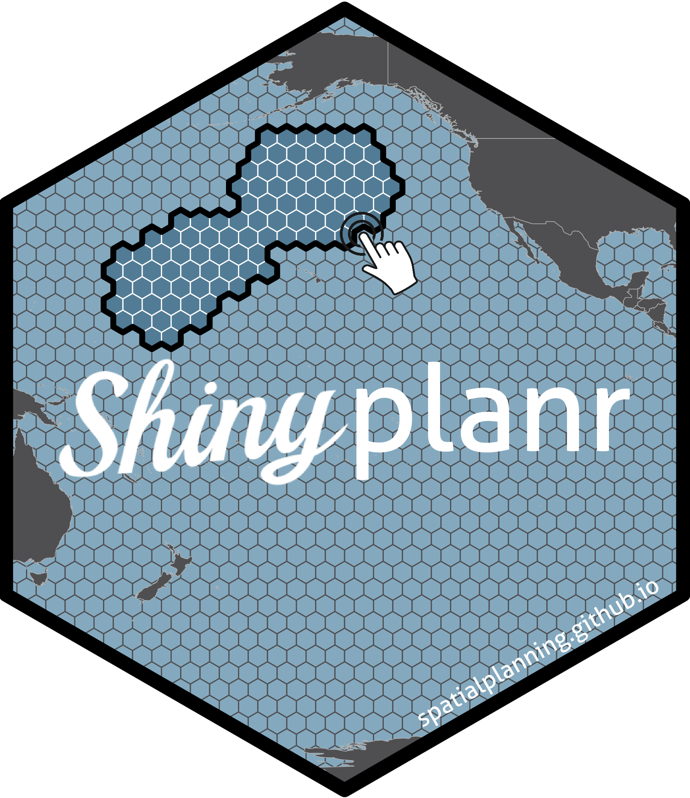

<!-- README.md is generated from README.Rmd. Please edit that file -->

```{r, include = FALSE}
knitr::opts_chunk$set(
  collapse = TRUE,
  comment = "#>",
  fig.path = "man/figures/README-",
  out.width = "100%"
)
```

# shinyplanr 

<!-- badges: start -->
[](https://lifecycle.r-lib.org/articles/stages.html#experimental)
[](https://github.com/SpatialPlanning/shinyplanr/actions/workflows/R-CMD-check.yaml)
[](https://github.com/SpatialPlanning/shinyplanr/actions/workflows/test-coverage.yaml)
<!-- badges: end -->

`shinyplanr` is an R package that provides a ready-to-deploy web application for spatial conservation planning. It gives ecologists, planners, and stakeholders an accessible browser-based interface for running spatial prioritisation analyses — no R experience required.

## What it does

The app is built on top of [prioritizr](https://prioritizr.net), which uses mathematical optimisation (integer linear programming) to identify the most efficient set of areas to protect or manage. `shinyplanr` wraps this powerful engine in an interactive point-and-click interface that can be deployed for any region with appropriate spatial data.

Key capabilities include:

- **Set biodiversity targets** — specify how much of each habitat, species distribution, or other feature should be represented in the solution
- **Choose a cost layer** — reflect real-world trade-offs such as equal area, distance from shore, or fishing effort
- **Apply constraints** — lock in existing protected areas or lock out shipping lanes, aquaculture zones, and other incompatible uses
- **Run analyses** — find the optimal spatial plan using fast, guaranteed-optimal ILP solvers
- **Compare scenarios** — run two configurations side-by-side to explore trade-offs between different management choices
- **Climate-smart planning** — optionally prioritise areas projected to be climate refugia under future change
- **Ecosystem services** — evaluate how much of services such as carbon storage and coastal protection a solution captures
- **Check coverage** — upload an existing spatial plan (e.g. a proposed protected area network) and see how well it meets feature targets
- **Download results** — export maps, tables, and self-contained HTML reports for sharing with stakeholders

## Who it is for

`shinyplanr` is designed to be deployed by an R developer or data administrator for a specific region, and then used by non-technical stakeholders — conservation managers, government agencies, researchers, and community groups — through a standard web browser.

## Installation

You can install the development version from GitHub:

``` r
# install.packages("pak")
pak::pak("SpatialPlanning/shinyplanr")
```

## Getting started

See the [Introduction](articles/aa-introduction.html) for the conceptual background on spatial prioritisation, and [Using shinyplanr](articles/ab-using-shinyplanr.html) for a full guide to the application interface. To set up a new deployment for your region, see [Setting Up](articles/ac-setting-up.html).

## Code of Conduct

Please note that the shinyplanr project is released with a [Contributor Code of Conduct](https://contributor-covenant.org/version/2/1/CODE_OF_CONDUCT.html). By contributing to this project, you agree to abide by its terms.
