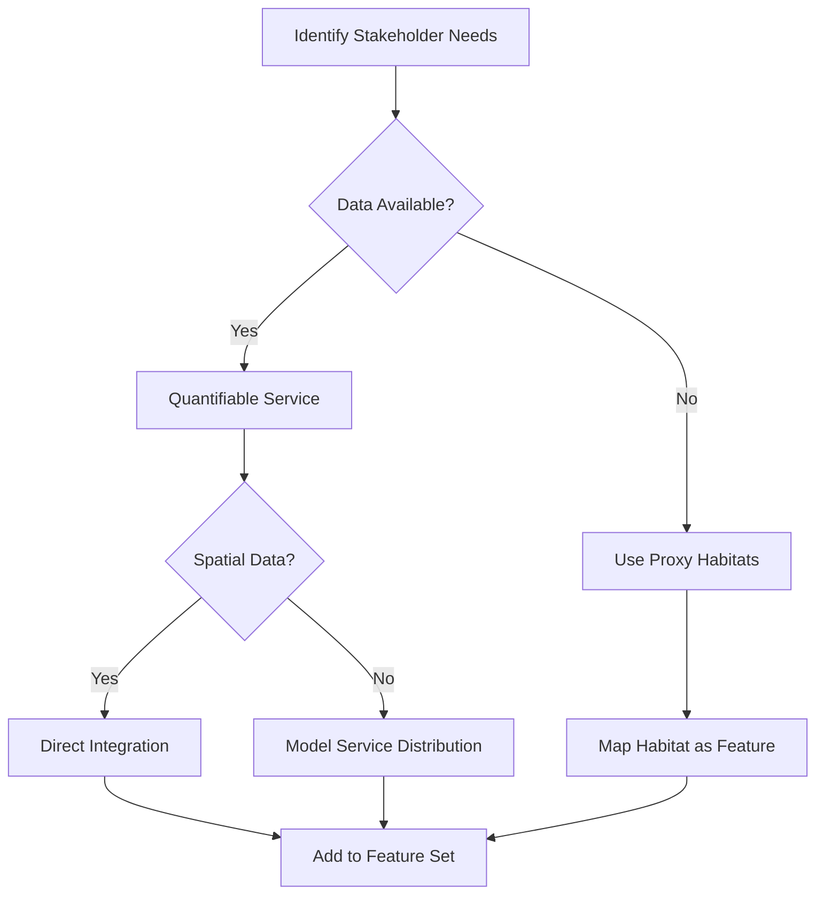

# shinyplanr Manual Review and Recommendations

**Reviewer**: AI Expert in Spatial Marine Conservation and R Shiny (Golem Framework)  
**Date**: April 2026  
**Document Reviewed**: shinyplanr Manual (index.qmd and all chapters)

---

## Executive Summary

The shinyplanr manual provides a solid foundation for both end users and deployers. The structure is logical, the writing is clear, and the coverage of key topics is comprehensive. However, there are several areas where additional detail, clarification, and examples would significantly enhance the manual's utility.

**Overall Assessment**: ⭐⭐⭐⭐☆ (4/5)

**Strengths**:
- Clear separation of audience (end users vs. deployers)
- Comprehensive coverage of technical setup and deployment
- Good balance of conceptual background and practical guidance
- Excellent use of visual placeholders for screenshots

**Areas for Improvement**:
- Missing practical examples and code walkthroughs
- Insufficient troubleshooting guidance in some sections
- Limited explanation of data requirements and validation
- Need more real-world case studies and workflows

---

## Chapter-by-Chapter Analysis

### Index.qmd (Preface)

#### ✅ Strengths
- Clear statement of purpose and target audience
- Good overview of manual structure
- Appropriate acknowledgements and citation

#### ⚠️ Gaps Identified

1. **Missing Version Information**
   - No mention of which version of shinyplanr this manual covers
   - No indication of R/package version requirements upfront

2. **Limited Getting Started Guidance**
   - No "Quick Start" checklist for new users
   - Missing "5-minute tour" for impatient users

3. **No Conventions/Notation Guide**
   - Code formatting conventions not explained
   - No legend for callout boxes (tip, warning, note)

#### 💡 Recommendations

**Add a "Document Conventions" section:**
```markdown
## Document Conventions {.unnumbered}

Throughout this manual:

- `code` represents R code, function names, or file paths
- **Bold** indicates UI elements (buttons, tabs, menus)
- *Italic* emphasizes package names and key terms
- 💡 Tip boxes provide helpful suggestions
- ⚠️ Warning boxes highlight potential issues
- ℹ️ Note boxes add contextual information
```

**Add version requirements table:**
```markdown
| Component | Minimum Version | Recommended |
|-----------|----------------|-------------|
| R | 4.1.0 | 4.3.0+ |
| shinyplanr | 0.5.0 | Latest |
| prioritizr | 8.0.0 | Latest |
| RStudio | 2022.07 | Latest |
```

**Add Quick Start flowchart:**
- End User Path: Install → Access app → Explore scenarios → Download results
- Deployer Path: Install → Prepare data → Configure → Deploy → Monitor

---

### Chapter 1: Introduction to Spatial Planning

#### ✅ Strengths
- Excellent conceptual foundation
- Clear explanation of systematic conservation planning
- Good coverage of climate-smart and multiple-use planning
- Well-integrated theoretical background

#### ⚠️ Gaps Identified

1. **Missing Concrete Examples**
   - No worked example of how planning units are actually defined
   - Abstract discussion of features without real data examples
   - No illustration of target-setting rationale with numbers

2. **Insufficient Mathematical Detail**
   - ILP formulation mentioned but not shown
   - No explanation of what "optimal" means mathematically
   - Gap between conceptual explanation and actual optimization

3. **Limited Climate-Smart Detail**
   - Climate refugia mentioned but calculation methods not explained
   - No specifics on which climate variables to use
   - Missing guidance on climate scenario selection

4. **Ecosystem Services Section Underdeveloped**
   - Only mangroves covered as example
   - No guidance on valuation methods
   - Missing integration strategies

#### 💡 Recommendations

**Add a worked example box:**
```markdown
::: {.callout-note}
## Example: Planning Units in Fiji

For Fiji's marine planning:
- **Region**: 1.3 million km² EEZ
- **Resolution**: 10 km hexagons
- **Number of PUs**: ~13,000 planning units
- **Size per PU**: ~77 km² each
- **Rationale**: Balances ecological relevance (habitat patch size) 
  with computational tractability

Larger planning units (20-50 km):
- Pros: Faster computation, fewer units to manage
- Cons: Loss of spatial detail, averaging of features

Smaller planning units (5 km):
- Pros: High spatial resolution, captures fine-scale variation
- Cons: Slower computation, more complex solutions
:::
```

**Add mathematical formulation:**
```markdown
### The Minimum Set Problem Formulation

Mathematically, the minimum set objective can be expressed as:

$$
\min \sum_{i=1}^{N} c_i x_i
$$

Subject to:

$$
\sum_{i=1}^{N} r_{ij} x_i \geq T_j \quad \forall j \in \{1, ..., F\}
$$

Where:
- $N$ = number of planning units
- $F$ = number of features
- $x_i$ = binary decision variable (1 = select PU $i$, 0 = don't select)
- $c_i$ = cost of planning unit $i$
- $r_{ij}$ = amount of feature $j$ in planning unit $i$
- $T_j$ = target for feature $j$

This guarantees finding the *globally optimal* solution—the cheapest 
possible set that meets all targets.
```

**Expand climate-smart section:**
```markdown
### Climate Data Requirements

To implement climate-smart planning, you need:

1. **Baseline Climate Data** (current conditions)
   - Sea surface temperature (SST)
   - Ocean pH
   - Dissolved oxygen
   - Salinity
   
2. **Future Projections** (typically 2050-2100)
   - CMIP6 model ensembles
   - Multiple emission scenarios (SSP2-4.5, SSP3-7.0, SSP5-8.5)
   - Downscaled to planning region resolution

3. **Derived Metrics**
   - Climate velocity: km/year of isotherm movement
   - Temperature anomaly: difference from baseline
   - Refugia score: areas with minimal projected change
   
4. **Data Sources**
   - Bio-ORACLE: [bio-oracle.org](https://bio-oracle.org)
   - NOAA ERDDAP servers
   - Regional climate models
```

**Add ecosystem services decision tree:**
```markdown
### Choosing Which Ecosystem Services to Include


```

---

### Chapter 2: Using the shinyplanr Application

#### ✅ Strengths
- Comprehensive coverage of all UI elements
- Good use of screenshots (placeholders)
- Clear step-by-step instructions
- Helpful tips and warnings

#### ⚠️ Gaps Identified

1. **Missing Workflow Examples**
   - No end-to-end example scenario
   - No guidance on typical analysis progression
   - Missing interpretation guidance for results

2. **Insufficient Comparison Guidance**
   - Limited explanation of what to compare
   - No suggested comparison scenarios
   - Missing interpretation of differences

3. **Download Options Unclear**
   - File formats not fully described
   - No guidance on using downloaded data in GIS
   - Missing explanation of file contents

4. **Limited Performance Guidance**
   - No indication of expected analysis times
   - Missing guidance on what makes analyses slow
   - No optimization tips for complex problems

5. **Constraint Interactions Not Explained**
   - What happens if constraints make problem infeasible?
   - How do locked-in areas affect costs?
   - No guidance on constraint prioritization

#### 💡 Recommendations

**Add a "Your First Analysis" tutorial:**
```markdown
## Tutorial: Your First Analysis {#sec-first-analysis}

Let's walk through a complete analysis for a hypothetical marine planning scenario.

### Scenario: Protecting 30% of Biodiversity in Fiji

**Objective**: Design a marine protected area network that:
- Protects 30% of each habitat type (30x30 commitment)
- Includes existing MPAs
- Minimizes conflict with fishing
- Considers climate refugia

**Step-by-Step:**

1. **Navigate to Scenario Tab**
   
2. **Set Targets**
   - Select "Master Target" mode
   - Set slider to 30%
   - This applies 30% to all features uniformly
   
3. **Select Cost Layer**
   - Choose "Fishing Effort" from dropdown
   - This makes areas with more fishing "expensive"
   - Algorithm will prefer areas with less fishing

4. **Add Constraints**
   - ✓ Check "Include Existing MPAs" (locked-in)
   - ✓ Check "Exclude Shipping Lanes" (locked-out)
   
5. **Enable Climate-Smart**
   - Select "Climate Refugia (SSP2-4.5)"
   - This gives preference to areas expected to experience less warming
   
6. **Run Analysis**
   - Click **Run Analysis**
   - Wait ~30-45 seconds
   
7. **Interpret Results**
   
   **Scenario Tab**: Shows your solution
   - Blue areas = selected for protection
   - Notice: clusters around existing MPAs (locked-in)
   - Notice: avoids major shipping routes (locked-out)
   
   **Targets Tab**: Shows achievement
   - All bars should reach the 30% line (green)
   - If any fall short (red), budget may be too restrictive
   
   **Cost Tab**: Shows fishing effort distribution
   - Compare solution to high-effort areas
   - Lower overlap = less fisheries conflict
   
8. **Download Results**
   - Click **Download Spatial File** to get .gpkg
   - Click **Download Report** for shareable HTML

### Understanding Your Results

**Total area selected**: Look at Details tab
- Example: "2,847 planning units selected"
- At 77 km² each = ~219,000 km² 
- This is ~17% of the EEZ

**Cost**: Total fishing effort in selected areas
- Lower = better for fisheries stakeholders
- Compare to alternative scenarios

**Target shortfalls**: Which features didn't meet 30%?
- Rare features may require more area
- Consider increasing budget or adjusting targets
```

**Add comparison scenario suggestions:**
```markdown
## Suggested Comparison Scenarios

### 1. Conservative vs Ambitious Targets
- **Scenario 1**: 20% targets (baseline)
- **Scenario 2**: 40% targets (ambitious)
- **Question**: How much more area/cost for higher protection?

### 2. Different Cost Layers
- **Scenario 1**: Equal area cost (minimize total area)
- **Scenario 2**: Fishing effort cost (minimize fisheries impact)
- **Question**: Where do solutions differ? What's the trade-off?

### 3. Climate-Smart vs Static Planning
- **Scenario 1**: No climate layer (current distributions)
- **Scenario 2**: Climate refugia enabled
- **Question**: How does climate change planning shift priorities?

### 4. Existing MPAs Impact
- **Scenario 1**: Include existing MPAs (locked-in)
- **Scenario 2**: No locked-in constraints
- **Question**: Are existing MPAs well-placed? How much do they contribute?

### 5. Budget Scenarios (Minimum Shortfall Objective)
- **Scenario 1**: 20% budget (limited resources)
- **Scenario 2**: 40% budget (more resources)
- **Question**: Which features benefit most from increased budget?
```

**Add file format explanations:**
```markdown
## Understanding Downloaded Files

### Spatial File (.gpkg - GeoPackage)

**What it contains**:
- Planning unit geometries (polygons)
- Solution column: 1 = selected, 0 = not selected
- Feature values for each planning unit
- Cost values

**How to use**:
```r
# In R
library(sf)
solution <- st_read("my_solution.gpkg")
plot(solution["solution_1"])

# Filter to selected areas only
protected <- solution[solution$solution_1 == 1, ]
```

```python
# In Python
import geopandas as gpd
solution = gpd.read_file("my_solution.gpkg")
protected = solution[solution.solution_1 == 1]
```

**In QGIS**:
1. Drag .gpkg file into QGIS
2. Style by "solution_1" column
3. Use 1 = blue, 0 = transparent

### Report File (.html)

**What it contains**:
- Complete analysis documentation
- All charts and maps
- Settings used
- Solver performance metrics

**How to use**:
- Open in any web browser
- Self-contained (includes all images)
- Share with stakeholders who don't have app access
- Print to PDF for reports

### Table File (.csv)

**What it contains**:
- Feature names
- Targets set
- Amount held in solution
- Percentage achieved

**How to use**:
```r
results <- read.csv("target_achievement.csv")
library(ggplot2)

ggplot(results, aes(x = feature, y = percent_held)) +
  geom_col() +
  geom_hline(yintercept = 30, color = "red") +
  coord_flip() +
  labs(title = "Target Achievement")
```
```

**Add performance expectations:**
```markdown
## Expected Performance and Optimization Tips

### Typical Analysis Times

| Scenario | Planning Units | Features | Climate | Approximate Time |
|----------|---------------|----------|---------|------------------|
| Small | < 1,000 | < 20 | No | 5-15 seconds |
| Medium | 1,000-5,000 | 20-50 | No | 15-60 seconds |
| Large | 5,000-15,000 | 50-100 | No | 1-3 minutes |
| Large + Climate | 5,000-15,000 | 50-100 | Yes | 3-10 minutes |
| Very Large | > 15,000 | > 100 | Yes | 5-20 minutes |

### What Slows Down Analyses?

1. **Many planning units**: Computational load scales with # of PUs
2. **Many features**: More constraints to satisfy
3. **Climate-smart options**: Additional optimization complexity
4. **Tight budgets**: Solver must work harder to find feasible solutions
5. **Boundary penalties**: Adds connectivity constraints

### Optimization Tips

**If analyses are too slow:**
- Disable climate-smart for initial exploration
- Use "Master Target" instead of individual targets initially
- Reduce the number of features (focus on key species/habitats)
- Consider if planning unit resolution could be coarser

**If you need faster iteration:**
- Run simple scenarios first to understand general patterns
- Once satisfied, add complexity (climate, more features)
- Use comparison mode to test specific questions efficiently
```

---

### Chapter 3: Setting Up shinyplanr for Your Region

#### ✅ Strengths
- Comprehensive setup workflow
- Good explanation of template function
- Clear file structure documentation
- Excellent coverage of data preparation

#### ⚠️ Gaps Identified

1. **Data Quality and Validation Missing**
   - No guidance on validating input data
   - Missing data checking procedures
   - No discussion of data resolution matching
   - Incomplete coverage of error handling

2. **Feature Selection Guidance Absent**
   - No criteria for choosing which features to include
   - Missing discussion of feature redundancy
   - No guidance on balancing comprehensiveness vs. tractability

3. **CRS Selection Underexplained**
   - Why equal-area is critical not fully explained
   - No troubleshooting for CRS issues
   - Missing validation procedures

4. **Testing Procedures Minimal**
   - Testing checklist is good but lacks depth
   - No unit testing examples
   - Missing validation of outputs

5. **Dict_Feature.csv Needs More Examples**
   - Only basic examples provided
   - Missing edge cases
   - No explanation of how categories affect UI

6. **Data Processing Examples Limited**
   - Need more examples of custom data integration
   - Missing examples of data cleaning
   - No workflow for updating existing deployments

#### 💡 Recommendations

**Add data validation section:**
```markdown
## Step 2.5: Validating Your Spatial Data {#sec-validate-data}

Before proceeding, validate your data to catch common issues.

### Validation Checklist

#### 1. Geometry Validity
```r
library(sf)

# Check for invalid geometries
invalid <- !st_is_valid(PUs)
if (any(invalid)) {
  message(sprintf("Found %d invalid geometries", sum(invalid)))
  PUs <- st_make_valid(PUs)
}

# Check for empty geometries
empty <- st_is_empty(PUs)
if (any(empty)) {
  message(sprintf("Removing %d empty geometries", sum(empty)))
  PUs <- PUs[!empty, ]
}
```

#### 2. CRS Consistency
```r
# All layers must have same CRS
layers <- list(PUs = PUs, bndry = bndry, coast = coast, 
               habitats = habitats)

crs_check <- sapply(layers, function(x) {
  if (inherits(x, "sf")) st_crs(x)$proj4string
  else if (inherits(x, "SpatRaster")) crs(x, describe = TRUE)$proj4string
})

if (length(unique(crs_check)) > 1) {
  stop("CRS mismatch detected! All layers must have same CRS.")
}
```

#### 3. Extent Overlap
```r
# Check that features overlap with planning units
check_overlap <- function(features_sf, pus_sf) {
  feat_bbox <- st_bbox(features_sf)
  pus_bbox <- st_bbox(pus_sf)
  
  overlap <- st_intersects(
    st_as_sfc(feat_bbox),
    st_as_sfc(pus_bbox),
    sparse = FALSE
  )
  
  if (!overlap[1,1]) {
    warning("Features and planning units don't overlap! Check CRS.")
  }
  return(overlap[1,1])
}
```

#### 4. Feature Value Ranges
```r
# Check feature values are reasonable
check_feature_values <- function(dat_sf) {
  feature_cols <- dat_sf %>% 
    st_drop_geometry() %>%
    select(where(is.numeric)) %>%
    names()
  
  for (col in feature_cols) {
    vals <- dat_sf[[col]]
    
    # Check for NAs
    n_na <- sum(is.na(vals))
    if (n_na > 0) {
      message(sprintf("%s: %d NA values (%.1f%%)", 
                      col, n_na, 100*n_na/length(vals)))
    }
    
    # Check for negative values (usually wrong)
    n_neg <- sum(vals < 0, na.rm = TRUE)
    if (n_neg > 0) {
      warning(sprintf("%s: %d negative values!", col, n_neg))
    }
    
    # Check for values > 1 (if proportions expected)
    if (all(vals >= 0 & vals <= 1, na.rm = TRUE)) {
      # Likely proportions, OK
    } else {
      message(sprintf("%s: range [%.2f, %.2f]", 
                      col, min(vals, na.rm=TRUE), max(vals, na.rm=TRUE)))
    }
  }
}

check_feature_values(dat_sf)
```

#### 5. Planning Unit Area
```r
# Calculate and validate planning unit areas
PUs$calculated_area <- st_area(PUs) %>% units::set_units(km^2)

area_summary <- summary(as.numeric(PUs$calculated_area))
print(area_summary)

# Check coefficient of variation (should be low for regular grids)
cv <- sd(as.numeric(PUs$calculated_area)) / mean(as.numeric(PUs$calculated_area))
message(sprintf("Area CV: %.3f", cv))

if (cv > 0.2) {
  warning("High variability in planning unit areas. Is this expected?")
}
```

### Common Data Issues and Solutions

| Issue | Symptom | Solution |
|-------|---------|----------|
| CRS mismatch | Features appear in wrong locations | Transform all to same CRS before processing |
| Invalid geometries | Errors during intersection | Use `st_make_valid()` |
| Missing data (NA) | Gaps in feature distributions | Decide: filter out, or set to 0? |
| Wrong units | Areas too large/small | Check if units are m² vs km² |
| Topology errors | Overlapping PUs | Regenerate grid |
| Out of bounds coordinates | Features outside planning region | Crop to boundary before processing |
```

**Add feature selection guidance:**
```markdown
## Choosing Which Features to Include {#sec-feature-selection}

### Decision Framework

Not all available data should become a feature. Consider:

#### 1. Ecological Relevance
- Does this represent a distinct conservation value?
- Is it recognized by stakeholders as important?
- Does it require specific spatial protection?

**Include**: Threatened species habitats, spawning areas, unique ecosystems
**Exclude**: Highly correlated proxies, administrative boundaries without ecological meaning

#### 2. Data Quality
- Is the data reliable and recent?
- What is the spatial resolution?
- Is coverage complete across the planning region?

**Minimum standards**:
- < 20% missing data
- Resolution ≤ 2× planning unit size
- Source documented and defensible

#### 3. Redundancy Check

Avoid including highly correlated features:

```r
# Calculate correlation matrix
feature_matrix <- dat_sf %>% 
  st_drop_geometry() %>%
  select(starts_with("habitat_"), starts_with("species_"))

cor_matrix <- cor(feature_matrix, use = "pairwise.complete.obs")

# Find highly correlated pairs (r > 0.9)
library(caret)
high_cor <- findCorrelation(cor_matrix, cutoff = 0.9, names = TRUE)

message("Consider removing: ", paste(high_cor, collapse = ", "))
```

#### 4. Computational Tractability

**Rule of thumb**: Keep total features < 100 for interactive app performance

- **< 30 features**: Very fast, good for stakeholder workshops
- **30-60 features**: Good balance
- **60-100 features**: Slower but manageable
- **> 100 features**: Consider grouping or prioritizing

#### 5. Stakeholder Relevance

Features visible to stakeholders drive engagement:

- Local names resonate better than scientific names
- Culturally important species should be included
- Economic species (fisheries) important for buy-in

### Example Feature Sets

**Minimal (20 features)**:
- 5 major habitat types
- 10 threatened species
- 3 depth zones  
- 2 bioregions

**Moderate (50 features)**:
- 10 habitat types
- 25 species (10 threatened, 15 characteristic)
- 5 depth zones
- 5 geomorphological features
- 5 bioregions

**Comprehensive (80 features)**:
- 15 habitat types
- 40 species
- 8 depth zones
- 10 geomorphological features
- 7 bioregions
```

**Add troubleshooting for CRS:**
```markdown
### CRS Troubleshooting

#### Problem: Features appear in wrong location

**Diagnosis:**
```r
# Check if layers are in different CRS
st_crs(PUs)$proj4string
st_crs(features)$proj4string
```

**Solution:**
```r
# Transform to match PUs
features <- st_transform(features, st_crs(PUs))
```

#### Problem: Areas calculated incorrectly

**Cause**: Using geographic (lat/lon) coordinates instead of projected

**Check:**
```r
st_is_longlat(PUs)  # Should be FALSE
```

**Solution**: Ensure using equal-area projection from start

#### Problem: "Cannot transform from NA to X"

**Cause**: CRS not defined

**Solution:**
```r
# Define CRS (if you know what it should be)
st_crs(my_data) <- "EPSG:4326"  # WGS84

# Then transform to planning CRS
my_data <- st_transform(my_data, crs = target_crs)
```
```

**Expand testing procedures:**
```markdown
### Advanced Testing

#### Unit Tests for Data Processing

Create `tests/testthat/test-data-validation.R`:

```r
library(testthat)

test_that("Planning units are valid geometries", {
  expect_true(all(st_is_valid(PUs)))
  expect_false(any(st_is_empty(PUs)))
})

test_that("All features are numeric", {
  feature_data <- dat_sf %>% 
    st_drop_geometry() %>%
    select(starts_with("habitat_"), starts_with("species_"))
  
  expect_true(all(sapply(feature_data, is.numeric)))
})

test_that("No features have all zeros", {
  feature_data <- dat_sf %>% 
    st_drop_geometry() %>%
    select(starts_with("habitat_"), starts_with("species_"))
  
  all_zero <- sapply(feature_data, function(x) all(x == 0, na.rm = TRUE))
  expect_false(any(all_zero))
})

test_that("Cost layers are positive", {
  costs <- dat_sf %>% 
    st_drop_geometry() %>%
    select(starts_with("Cost_"))
  
  expect_true(all(costs >= 0, na.rm = TRUE))
})
```

#### Integration Test: Run a Simple Problem

```r
# Minimal test problem
test_problem <- function(dat_sf) {
  library(prioritizr)
  
  # Select one feature
  features <- dat_sf %>% select(habitat_coral)
  
  # Simple problem
  p <- problem(
    dat_sf, 
    features = "habitat_coral",
    cost_column = "Cost_Area"
  ) %>%
    add_min_set_objective() %>%
    add_relative_targets(0.3) %>%
    add_default_solver(gap = 0.1, verbose = FALSE)
  
  # Solve
  s <- solve(p)
  
  # Check solution is valid
  expect_true("solution_1" %in% names(s))
  expect_true(all(s$solution_1 %in% c(0, 1)))
  expect_true(sum(s$solution_1) > 0)
  
  message("✓ Test problem solved successfully")
  return(TRUE)
}

test_problem(dat_sf)
```
```

---

### Chapter 4: Deploying to Posit Connect

#### ✅ Strengths
- Comprehensive deployment workflow
- Good coverage of multiple deployment methods
- Excellent troubleshooting section
- Clear explanation of runtime settings

#### ⚠️ Gaps Identified

1. **Missing Alternative Deployment Options**
   - No coverage of shinyapps.io
   - No discussion of self-hosted Shiny Server
   - Missing Docker deployment option

2. **Insufficient Security Guidance**
   - Limited discussion of authentication
   - No guidance on API key management
   - Missing HTTPS/SSL considerations

3. **Performance Tuning Underexplained**
   - Runtime settings mentioned but not justified
   - No benchmarking guidance
   - Missing load testing procedures

4. **Update Strategy Minimal**
   - No versioning strategy
   - Missing rollback procedures
   - No blue-green deployment discussion

5. **Monitoring and Analytics Absent**
   - No discussion of usage analytics
   - Missing error tracking recommendations
   - No uptime monitoring guidance

#### 💡 Recommendations

**Add alternative deployment section:**
```markdown
## Alternative Deployment Options {#sec-alternative-deployment}

While Posit Connect is recommended, other options exist:

### shinyapps.io (Cloud Hosting)

**Pros**:
- Free tier available
- No server management
- Quick setup

**Cons**:
- Limited compute resources on free tier
- May timeout on large analyses
- Less control over environment

**Deployment:**
```r
library(rsconnect)

# Configure account (one-time)
rsconnect::setAccountInfo(
  name = "your-account",
  token = "your-token",
  secret = "your-secret"
)

# Deploy
rsconnect::deployApp(
  appName = "my-shinyplanr",
  appTitle = "Region Spatial Planning",
  account = "your-account"
)
```

### Self-Hosted Shiny Server (On-Premises)

**Pros**:
- Full control
- No per-user costs
- Can handle sensitive data

**Cons**:
- Requires server administration
- Manual scaling
- Your responsibility for uptime

**Setup**: See [Shiny Server Admin Guide](https://docs.posit.co/shiny-server/)

### Docker Deployment

**Pros**:
- Portable and reproducible
- Easy scaling with orchestration (Kubernetes)
- Consistent environments

**Example Dockerfile:**
```dockerfile
FROM rocker/shiny:4.3.0

# Install system dependencies
RUN apt-get update && apt-get install -y \
    libgdal-dev \
    libgeos-dev \
    libproj-dev \
    && rm -rf /var/lib/apt/lists/*

# Install R packages
RUN R -e "install.packages(c('shiny', 'golem', 'prioritizr', 'sf'))"
RUN R -e "remotes::install_github('SpatialPlanning/spatialplanr')"

# Copy app
COPY . /srv/shiny-server/shinyplanr

# Expose port
EXPOSE 3838

# Run app
CMD ["/usr/bin/shiny-server"]
```

**Build and run:**
```bash
docker build -t shinyplanr .
docker run -p 3838:3838 shinyplanr
```

### Comparison Table

| Platform | Cost | Ease | Control | Performance |
|----------|------|------|---------|-------------|
| Posit Connect | $$$ | ⭐⭐⭐⭐ | ⭐⭐⭐⭐ | ⭐⭐⭐⭐⭐ |
| shinyapps.io | $ | ⭐⭐⭐⭐⭐ | ⭐⭐ | ⭐⭐⭐ |
| Shiny Server | Free | ⭐⭐ | ⭐⭐⭐⭐⭐ | ⭐⭐⭐⭐ |
| Docker | Variable | ⭐⭐⭐ | ⭐⭐⭐⭐⭐ | ⭐⭐⭐⭐ |
```

**Add security best practices:**
```markdown
## Security Considerations {#sec-security}

### Authentication and Authorization

#### Posit Connect Access Levels

1. **Public Access**: Anyone with URL can access
   - Use for: Public engagement, non-sensitive data
   - Risk: Data exposure, potential misuse

2. **Organization-wide**: All authenticated users
   - Use for: Internal stakeholders, preliminary results
   - Risk: Internal data leaks

3. **Group-based**: Specific user groups
   - Use for: Sensitive planning, pre-publication data
   - **Recommended for most deployments**

4. **Individual users**: Named accounts only
   - Use for: Highly sensitive, embargoed data

#### API Keys and Secrets

**Never commit secrets to Git!**

```r
# BAD - Don't do this
api_key <- "secret-key-12345"

# GOOD - Use environment variables
api_key <- Sys.getenv("MY_API_KEY")

# GOOD - Use Posit Connect Vars
api_key <- Sys.getenv("API_KEY")  # Set in Connect UI
```

**Use .Renviron for local development:**
```bash
# .Renviron (add to .gitignore!)
MY_API_KEY=secret-key-12345
DATABASE_PASSWORD=another-secret
```

### HTTPS/SSL

- Posit Connect handles SSL automatically
- For self-hosted: Use Let's Encrypt or organizational certificates
- Never serve over HTTP for production

### Data Security

#### Sensitive Data Checklist

- [ ] Is data anonymized (no personal information)?
- [ ] Is data aggregated to appropriate resolution?
- [ ] Are commercial-sensitive layers protected?
- [ ] Is intellectual property clearly attributed?

#### Handling Embargoed Data

If working with unpublished data:
1. Use strictest access controls
2. Add watermarks to maps
3. Disable download buttons until publication
4. Log all access for accountability

### Audit Logging

Monitor who accesses the app:

```r
# In app server logic
observe({
  # Log user access
  user <- session$user
  timestamp <- Sys.time()
  
  write.table(
    data.frame(user = user, time = timestamp, action = "app_loaded"),
    file = "logs/access.log",
    append = TRUE,
    row.names = FALSE
  )
})
```
```

**Add performance tuning guidance:**
```markdown
## Performance Optimization {#sec-performance-tuning}

### Benchmarking Your App

Before deployment, benchmark typical operations:

```r
library(microbenchmark)

# Benchmark typical problem
benchmark <- microbenchmark(
  solve(my_problem),
  times = 10
)

print(summary(benchmark))
# Median time should be < 60 seconds for good UX
```

### Runtime Settings Explained

#### Min and Max Processes

**Min processes = 0**:
- Server starts processes on-demand
- Saves memory when app idle
- First user experiences cold start (5-10 seconds)
- **Use for**: Infrequently used apps

**Min processes = 1**:
- One process always running
- Instant access for first user
- Uses memory even when idle
- **Use for**: Frequently accessed apps, workshops

**Max processes**:
- Limits concurrent users
- Each process handles ~5-20 connections
- **Formula**: Expected peak users / 10 = max processes
- Example: 50 users → 5 max processes

#### Memory Allocation

Estimate memory needs:

```r
# Check memory used by data
object.size(dat_sf) %>% format("MB")

# Monitor during solve
Rprofmem("memory.out")
solution <- solve(problem)
# Check memory.out file
```

**Recommendations**:
- Small apps (< 1000 PUs): 512 MB per process
- Medium apps (1000-5000 PUs): 1-2 GB per process
- Large apps (> 5000 PUs): 2-4 GB per process

If using Gurobi on large problems: 4-8 GB

### Caching Strategies

Speed up repeated analyses:

```r
# Cache expensive computations
library(memoise)

# Memoise solver (careful - invalidate on data changes)
solve_cached <- memoise(prioritizr::solve)

# Use in app
solution <- solve_cached(problem)
```

### Async Processing

For very long analyses (> 2 minutes), consider async:

```r
library(future)
library(promises)

plan(multisession)

# In server logic
future_promise({
  solve(complex_problem)
}) %...>% (function(solution) {
  # Update UI with solution
}) %...!% (function(error) {
  showNotification("Solve failed", type = "error")
})
```
```

---

### Chapter 5: Useful Tools

#### ✅ Strengths
- Good overview of package ecosystem
- Clear explanation of package relationships
- Helpful function references

#### ⚠️ Gaps Identified

1. **Missing Workflow Integration Examples**
   - Packages described in isolation
   - No complete workflow examples
   - Missing data pipeline illustrations

2. **Limited Troubleshooting**
   - Package installation issues not fully covered
   - Missing common error messages
   - No debugging strategies

3. **Advanced Features Underutilized**
   - prioritizr zones mentioned but not detailed
   - No portfolio analysis
   - Missing irreplaceability calculations

4. **Data Processing Workflows Incomplete**
   - Need more oceandatr + spatialgridr examples
   - Missing data cleaning workflows
   - No integration with other data sources (e.g., GBIF, OBIS)

#### 💡 Recommendations

**Add complete workflow example:**
```markdown
## Complete Workflow Example: From Scratch to Deployment {#sec-complete-workflow}

This example shows the entire process of creating a shinyplanr app for a new region.

### Scenario: Setting up for Kosrae, Micronesia

```r
#------------------------------------------------------------------------------
# STEP 1: Setup
#------------------------------------------------------------------------------
library(oceandatr)
library(spatialgridr)
library(spatialplanr)
library(prioritizr)
library(sf)
library(dplyr)

# Define parameters
region <- "Kosrae"
region_crs <- "+proj=cea +lon_0=163 +lat_ts=2.8 +datum=WGS84 +units=m"
resolution <- 5000  # 5 km hexagons

#------------------------------------------------------------------------------
# STEP 2: Get Boundary
#------------------------------------------------------------------------------
# Get EEZ
eez <- oceandatr::get_boundary(name = region, type = "eez") %>%
  st_transform(crs = region_crs)

# Get land (for coastline)
land <- oceandatr::get_boundary(name = region, type = "land") %>%
  st_transform(crs = region_crs)

# Create buffer for coastal zone (10 km)
coastal_buffer <- st_buffer(land, dist = 10000)

#------------------------------------------------------------------------------
# STEP 3: Create Planning Unit Grid
#------------------------------------------------------------------------------
PUs <- spatialgridr::get_grid(
  boundary = eez,
  resolution = resolution,
  crs = region_crs,
  output = "sf_hex"
)

# Remove planning units that overlap land
PUs <- PUs %>%
  mutate(overlaps_land = lengths(st_intersects(., land)) > 0) %>%
  filter(!overlaps_land) %>%
  select(-overlaps_land)

# Add planning unit ID
PUs$puid <- seq_len(nrow(PUs))

message(sprintf("Created %d planning units", nrow(PUs)))

#------------------------------------------------------------------------------
# STEP 4: Download Feature Data
#------------------------------------------------------------------------------

## 4a. Bathymetry/Depth Zones
bathy <- oceandatr::get_bathymetry(
  spatial_grid = PUs,
  classify_bathymetry = TRUE,
  cache_dir = "data-raw/cache"
) %>% st_drop_geometry()

## 4b. Geomorphology
geom <- oceandatr::get_geomorphology(
  spatial_grid = PUs,
  cache_dir = "data-raw/cache"
) %>% 
  oceandatr::remove_empty_layers() %>%
  st_drop_geometry()

## 4c. Seamounts
seamounts <- oceandatr::get_seamounts(
  spatial_grid = PUs,
  buffer = 10000,  # 10 km buffer
  cache_dir = "data-raw/cache"
) %>% st_drop_geometry()

## 4d. Deep-sea coral habitat
coral_habitat <- oceandatr::get_coral_habitat(
  spatial_grid = PUs,
  cache_dir = "data-raw/cache"
) %>% st_drop_geometry()

## 4e. Knolls
knolls <- oceandatr::get_knolls(
  spatial_grid = PUs,
  cache_dir = "data-raw/cache"
) %>% st_drop_geometry()

#------------------------------------------------------------------------------
# STEP 5: Add Custom Local Data
#------------------------------------------------------------------------------

## 5a. Example: Load coral reef data from local shapefile
coral_reefs <- st_read("data-raw/Kosrae/data/coral_reefs.shp") %>%
  st_transform(crs = region_crs)

# Extract to planning units
coral_in_pus <- spatialgridr::get_data_in_grid(
  spatial_grid = PUs,
  dat = coral_reefs,
  feature_names = "reef_type",  # Column with reef types
  meth = "binary",
  cutoff = 0.1  # At least 10% overlap
)

## 5b. Example: Species occurrence data from OBIS
library(robis)

# Get turtle sightings
turtles <- occurrence(
  scientificname = "Chelonia mydas",
  geometry = st_as_text(st_as_sfc(st_bbox(eez)))
)

if (nrow(turtles) > 0) {
  turtle_sf <- st_as_sf(
    turtles, 
    coords = c("decimalLongitude", "decimalLatitude"),
    crs = 4326
  ) %>%
    st_transform(crs = region_crs)
  
  # Create density surface
  turtle_density <- spatialgridr::get_data_in_grid(
    spatial_grid = PUs,
    dat = turtle_sf,
    name = "turtle_density",
    meth = "count"
  )
} else {
  turtle_density <- data.frame(turtle_density = 0)
}

#------------------------------------------------------------------------------
# STEP 6: Calculate Cost Layers
#------------------------------------------------------------------------------

## 6a. Equal area cost
equal_cost <- PUs %>%
  st_drop_geometry() %>%
  mutate(Cost_Area = st_area(PUs) %>% units::set_units(km^2) %>% as.numeric())

## 6b. Distance to coast cost
dist_coast <- PUs %>%
  spatialplanr::splnr_get_distCoast(custom_coast = land) %>%
  st_drop_geometry() %>%
  mutate(Cost_Distance = coastDistance_km)

## 6c. Example: Fishing effort (if available)
# fishing_effort <- st_read("data-raw/Kosrae/data/fishing.shp")
# ...

#------------------------------------------------------------------------------
# STEP 7: Get Existing MPAs
#------------------------------------------------------------------------------
mpas <- spatialplanr::splnr_get_MPAs(
  PlanUnits = PUs,
  Countries = region
) %>%
  st_transform(crs = region_crs)

if (nrow(mpas) > 0) {
  mpa_layer <- spatialgridr::get_data_in_grid(
    spatial_grid = PUs,
    dat = mpas,
    name = "mpas",
    cutoff = 0.5  # >50% overlap
  )
} else {
  mpa_layer <- data.frame(mpas = 0)
}

#------------------------------------------------------------------------------
# STEP 8: Combine All Data
#------------------------------------------------------------------------------
dat_sf <- bind_cols(
  PUs,
  bathy,
  geom,
  seamounts,
  coral_habitat,
  knolls,
  coral_in_pus %>% st_drop_geometry(),
  turtle_density,
  equal_cost,
  dist_coast %>% select(Cost_Distance),
  mpa_layer
)

# Clean column names
names(dat_sf) <- gsub("[^A-Za-z0-9_]", "_", names(dat_sf))

#------------------------------------------------------------------------------
# STEP 9: Validate Data
#------------------------------------------------------------------------------
# Check for NAs
na_summary <- dat_sf %>%
  st_drop_geometry() %>%
  summarise(across(everything(), ~sum(is.na(.))))

print("NA counts per column:")
print(t(na_summary))

# Check for all-zero columns
zero_cols <- dat_sf %>%
  st_drop_geometry() %>%
  summarise(across(where(is.numeric), ~all(. == 0, na.rm = TRUE))) %>%
  select(where(~.)) %>%
  names()

if (length(zero_cols) > 0) {
  warning("Columns with all zeros: ", paste(zero_cols, collapse = ", "))
}

#------------------------------------------------------------------------------
# STEP 10: Save
#------------------------------------------------------------------------------
save(dat_sf, eez, land, file = "data-raw/Kosrae/Kosrae_RawData.rda")

message("✓ Data preparation complete!")
message(sprintf("  - %d planning units", nrow(dat_sf)))
message(sprintf("  - %d feature columns", ncol(dat_sf) - 2))  # Minus geom + puid
message(sprintf("  - Saved to: data-raw/Kosrae/Kosrae_RawData.rda"))
```

### Next Steps

1. Edit `Dict_Feature.csv` to describe all columns
2. Run `setup-app.R` to configure the app
3. Test locally with `shinyplanr::run_app()`
4. Deploy to Posit Connect
```

**Add advanced prioritizr features:**
```markdown
## Advanced prioritizr Features {#sec-advanced-prioritizr}

### Zones (Multiple-Use Planning)

Create differentiated management zones:

```r
library(prioritizr)

# Define three management zones
zones <- zones(
  "No-Take MPA" = list(cost = "Cost_Area"),
  "Restricted Use" = list(cost = "Cost_Area"),
  "Multiple Use" = list(cost = "Cost_Area")
)

# Zone-specific targets
# Rows = features, Columns = zones
targets <- matrix(
  c(
    # No-Take, Restricted, Multiple-Use
    0.20,  0.10,  0.00,   # Coral reefs
    0.15,  0.15,  0.05,   # Seagrass
    0.10,  0.10,  0.10    # Deep sea
  ),
  ncol = 3,
  byrow = TRUE,
  dimnames = list(
    c("coral", "seagrass", "deep_sea"),
    c("No-Take", "Restricted", "Multiple-Use")
  )
)

# Build problem
p <- problem(
  x = PUs,
  zones = zones
) %>%
  add_min_set_objective() %>%
  add_relative_targets(targets) %>%
  add_default_solver()

s <- solve(p)

# Each zone gets a solution column
# s$solution_1_No-Take
# s$solution_1_Restricted  
# s$solution_1_Multiple-Use
```

### Portfolio Analysis

Generate multiple different solutions:

```r
# Portfolio of 10 solutions
p_portfolio <- problem(PUs, features, cost_column = "cost") %>%
  add_min_set_objective() %>%
  add_relative_targets(0.3) %>%
  add_default_solver(gap = 0.1) %>%
  add_portfolio(number_solutions = 10)

s_portfolio <- solve(p_portfolio)

# Results in 10 solution columns
# s_portfolio$solution_1, solution_2, ..., solution_10

# Find selection frequency (how often each PU selected)
selection_freq <- rowMeans(
  s_portfolio %>% 
    st_drop_geometry() %>% 
    select(starts_with("solution_"))
)

PUs$selection_frequency <- selection_freq

# Map it
library(ggplot2)
ggplot(PUs) +
  geom_sf(aes(fill = selection_frequency), color = NA) +
  scale_fill_viridis_c(option = "magma") +
  labs(title = "Selection Frequency Across 10 Solutions",
       fill = "Frequency")
```

### Irreplaceability Analysis

Identify planning units critical for meeting targets:

```r
# For each PU, how much does removing it hurt target achievement?
library(parallel)

irreplaceability <- mclapply(seq_len(nrow(PUs)), function(i) {
  # Lock out this PU
  locked_out <- rep(0, nrow(PUs))
  locked_out[i] <- 1
  
  PUs$locked_out_temp <- locked_out
  
  # Solve without this PU
  p_temp <- problem(PUs, features, cost_column = "cost") %>%
    add_min_shortfall_objective(budget = 5000) %>%
    add_relative_targets(0.3) %>%
    add_locked_out_constraints("locked_out_temp") %>%
    add_default_solver(gap = 0.1, verbose = FALSE)
  
  s_temp <- solve(p_temp)
  
  # Calculate shortfall
  eval_target_coverage_summary(p_temp, s_temp) %>%
    pull(relative_held) %>%
    mean()  # Average proportion held
  
}, mc.cores = 4)

PUs$irreplaceability <- 1 - unlist(irreplaceability)

# High irreplaceability = removing this PU causes big problems
ggplot(PUs) +
  geom_sf(aes(fill = irreplaceability), color = NA) +
  scale_fill_viridis_c(option = "plasma") +
  labs(title = "Irreplaceability", fill = "Score")
```
```

---

### Appendix A: Software Setup

#### ✅ Strengths
- Comprehensive installation instructions
- Good solver comparison
- Multi-platform coverage
- Helpful verification script

#### ⚠️ Gaps Identified

1. **Missing System-Specific Issues**
   - Limited macOS Apple Silicon guidance
   - Windows-specific path issues not covered
   - Linux distribution differences minimal

2. **Version Compatibility Matrix Missing**
   - No table showing which versions work together
   - Missing R version compatibility

3. **Offline Installation Not Covered**
   - No guidance for air-gapped systems
   - Missing package bundle instructions

#### 💡 Recommendations

**Add platform-specific notes:**
```markdown
## Platform-Specific Notes {#sec-platform-notes}

### macOS Apple Silicon (M1/M2/M3)

Some packages need special handling:

```r
# Install sf (may need Homebrew libraries first)
# In Terminal:
# brew install gdal proj geos

# Then in R:
install.packages("sf", type = "source")
```

**Gurobi on Apple Silicon:**
- Download ARM64 version
- Install path: `/Library/gurobi1100/macos_arm64/`

### Windows

**Path length limitations:**
- Windows has 260 character path limit
- Keep project in short paths: `C:/shinyplanr/` not `C:/Users/very/long/path/`

**Rtools required for some packages:**
```r
# Install Rtools from: https://cran.r-project.org/bin/windows/Rtools/
# Then:
install.packages("prioritizr", type = "source")
```

### Linux (Ubuntu 22.04 LTS)

Complete setup script:

```bash
#!/bin/bash
# Install R
sudo apt update
sudo apt install -y r-base r-base-dev

# Spatial libraries
sudo apt install -y \
  libgdal-dev \
  libgeos-dev \
  libproj-dev \
  libudunits2-dev \
  libsqlite3-dev \
  libssl-dev \
  libcurl4-openssl-dev \
  libxml2-dev

# HiGHS solver dependencies
sudo apt install -y cmake

# Done!
```
```

**Add compatibility matrix:**
```markdown
## Version Compatibility Matrix {#sec-version-matrix}

Tested combinations as of April 2026:

| R Version | prioritizr | spatialplanr | shinyplanr | Status |
|-----------|------------|--------------|------------|--------|
| 4.3.3 | 8.0.4 | 0.7.0 | 0.6.0 | ✅ Recommended |
| 4.2.3 | 8.0.4 | 0.6.9 | 0.5.0 | ✅ Stable |
| 4.1.3 | 7.2.2 | 0.6.0 | 0.4.0 | ⚠️ Older, works |
| 4.4.0 | 8.0.4 | 0.7.0 | 0.6.0 | ✅ Latest |

**Key dependencies:**

- **sf** ≥ 1.0.9
- **terra** ≥ 1.7.0
- **shiny** ≥ 1.7.0
- **golem** ≥ 0.4.0

**Solver compatibility:**

- **HiGHS**: R ≥ 4.0
- **Gurobi**: R ≥ 4.1, Gurobi ≥ 10.0
- **CBC**: R ≥ 4.0
```

---

### Appendix B: MinPatch

#### ✅ Strengths
- Clear explanation of the fragmentation problem
- Good comparison with existing methods
- Honest about implementation status

#### ⚠️ Gaps Identified

1. **Missing Implementation Timeline**
   - No indication of when feature might be available
   - No GitHub issue link for tracking

2. **Workarounds Could Be More Detailed**
   - Brief mention of alternatives
   - Need code examples for workarounds

#### 💡 Recommendations

**Add workaround examples:**
```markdown
## Detailed Workarounds {#sec-minpatch-workarounds}

Until MinPatch is integrated, use these approaches:

### Approach 1: Aggressive Boundary Penalties

```r
# Experiment with boundary penalty values
penalties <- c(0.0001, 0.001, 0.01, 0.1)

solutions <- lapply(penalties, function(pen) {
  problem(PUs, features, cost_column = "cost") %>%
    add_min_set_objective() %>%
    add_relative_targets(0.3) %>%
    add_boundary_penalties(penalty = pen) %>%
    add_default_solver(gap = 0.05) %>%
    solve()
})

# Check patch sizes in each solution
# (requires spatialplanr::splnr_get_patches or similar)
```

### Approach 2: Post-Processing Filter

```r
library(sf)

# Solve first
solution <- solve(problem)

# Identify patches
selected <- solution[solution$solution_1 == 1, ]
patches <- st_cast(st_union(selected), "POLYGON")

# Calculate areas
patch_areas <- st_area(patches) %>% units::set_units(km^2)

# Filter to patches > 50 km²
min_size <- 50  # km²
large_patches <- patches[patch_areas >= min_size]

# Map back to planning units
solution$in_large_patch <- lengths(st_intersects(solution, large_patches)) > 0
solution$solution_filtered <- ifelse(
  solution$solution_1 == 1 & solution$in_large_patch,
  1,
  0
)
```

### Approach 3: Iterative Seeded Growth

```r
# Start with seeds (e.g., existing MPAs)
seeds <- PUs[PUs$mpa == 1, ]

# Grow regions around seeds
library(igraph)

# Create adjacency graph
adj_matrix <- st_touches(PUs, sparse = FALSE)
graph <- graph_from_adjacency_matrix(adj_matrix, mode = "undirected")

# Assign components
components <- components(graph)
PUs$region <- components$membership

# Solve within regions
# This ensures connected solutions
```
```

---

## Cross-Cutting Issues and General Recommendations

### 1. **Add More Visual Aids**

Throughout the manual, add:
- **Flowcharts** for decision-making
- **Concept diagrams** for abstract ideas
- **Before/after** comparisons
- **Annotated screenshots** with callouts

### 2. **Include Case Studies**

Add 2-3 complete case studies:
- **Case Study 1**: Simple coral reef planning (Fiji)
- **Case Study 2**: Climate-smart planning with fisheries cost (Kiribati)
- **Case Study 3**: Multiple-use zoning (Southeast Australia)

Each should include:
- Background and objectives
- Data sources
- Configuration choices and justification
- Results and interpretation
- Stakeholder engagement outcomes

### 3. **Create a Glossary**

Add a comprehensive glossary:
- **Planning unit**: ...
- **Feature**: ...
- **Target**: ...
- **Objective function**: ...
- **Solver**: ...
- **Gap**: ...
- **Locked-in constraint**: ...
- (etc.)

### 4. **Add FAQ Section to Main Manual**

Not just in Help tab, but consolidated in manual:

**Common Questions:**
- Why are my targets not met?
- Why does the solution look fragmented?
- How do I choose planning unit size?
- What's a reasonable number of features?
- How do I explain results to non-technical stakeholders?

### 5. **Include Troubleshooting Decision Trees**

Example:
```
Problem: Analysis fails
├─ Check 1: Are targets realistic? (not 100%)
│  ├─ Yes → Go to Check 2
│  └─ No → Reduce targets
├─ Check 2: Are locked-in areas already meeting targets?
│  ├─ Yes → Remove some locked-in or increase budget
│  └─ No → Go to Check 3
├─ Check 3: Is budget sufficient?
   ├─ Yes → Check solver logs
   └─ No → Increase budget
```

### 6. **Add a "Quick Reference" Card**

One-page cheat sheet:
- Common R commands
- File locations
- Deployment checklist
- Troubleshooting contacts

### 7. **Version Control and Changelog**

Add to manual:
- **Current version**: What's new in this version
- **Changelog**: History of changes
- **Deprecated features**: What's been removed
- **Upcoming features**: What's planned (including MinPatch)

### 8. **Add Accessibility Considerations**

- Color-blind friendly palettes
- Alt text for all images
- Screen reader compatibility notes
- Keyboard navigation in app

### 9. **Include Reproducibility Section**

Best practices:
- Recording session info
- Documenting data provenance
- Version controlling configurations
- Archiving results

```r
# Include in reports
sessionInfo()
packageVersion("shinyplanr")
packageVersion("prioritizr")
```

### 10. **Add Bibliography Management**

Some citations incomplete:
- jones2016incorporating cited but could add more climate refs
- Consider adding Marxan comparison papers
- Include golem framework paper
- Add sf and terra package citations

---

## Priority Recommendations

If time/resources are limited, prioritize:

### High Priority (Do First)
1. ✅ Add complete workflow example (Chapter 3)
2. ✅ Add "Your First Analysis" tutorial (Chapter 2)
3. ✅ Add data validation section (Chapter 3)
4. ✅ Add platform-specific notes (Appendix A)
5. ✅ Add FAQ/troubleshooting decision trees

### Medium Priority
6. Add case studies
7. Expand climate-smart section
8. Add security best practices
9. Add feature selection guidance
10. Create glossary

### Nice to Have
11. MinPatch workaround details
12. Advanced prioritizr features
13. Alternative deployment options
14. Performance benchmarking guide
15. Reproducibility section

---

## Summary Assessment by Chapter

| Chapter | Current Quality | Priority Improvements |
|---------|----------------|----------------------|
| Index | ⭐⭐⭐⭐ | Add conventions, quick start |
| Ch 1: Introduction | ⭐⭐⭐⭐ | Add examples, math detail |
| Ch 2: Using App | ⭐⭐⭐⭐ | Add tutorial, workflows |
| Ch 3: Setup | ⭐⭐⭐⭐ | Add validation, testing |
| Ch 4: Deployment | ⭐⭐⭐⭐ | Add alternatives, security |
| Ch 5: Tools | ⭐⭐⭐ | Add workflows, integration |
| Appendix A | ⭐⭐⭐⭐ | Add compatibility matrix |
| Appendix B | ⭐⭐⭐ | Add workarounds, timeline |

**Overall**: ⭐⭐⭐⭐ (Very Good - Minor improvements needed)

---

## Conclusion

Your shinyplanr manual is well-structured and comprehensive. The main gaps are:

1. **Practical examples**: Need more real-world workflows and tutorials
2. **Troubleshooting**: Could be more detailed with decision trees
3. **Data validation**: Missing systematic validation procedures
4. **Advanced features**: Some powerful capabilities underexplored

The manual serves its dual audience (users and deployers) well, but would benefit from more bridging content showing complete end-to-end workflows.

**Recommendation**: Focus on adding 2-3 complete tutorials/case studies that demonstrate the full capability of the tool. These will serve as templates users can adapt to their own regions.

---

**Document Ends**
