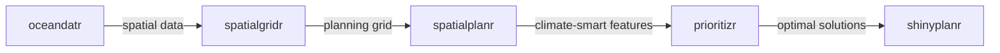

# Setting Up shinyplanr for Your Region

This chapter guides deployers through the process of setting up a new
*shinyplanr* instance for a specific region. We cover the template
creation function, data preparation, configuration options, and the
feature dictionary. For instructions on deploying the finished app to
Posit Connect, see the [Deployment
vignette](https://spatialplanning.github.io/shinyplanr/articles/ad-deployment.md).

> **Note**
>
> The setup process creates a **standalone deployment project** — a
> separate R project that holds your region-specific data and
> configuration. You do not need to modify or fork the shinyplanr
> package source code.

## The shinyplanr ecosystem

*shinyplanr* sits at the end of a pipeline of interconnected R packages.
Understanding which package does what will help you navigate the setup
scripts.



| Package | Role in setup |
|----|----|
| [*oceandatr*](https://emlab-ucsb.github.io/oceandatr/) | Downloads marine spatial data (bathymetry, geomorphology, coral habitat, EEZ boundaries) |
| [*spatialgridr*](https://emlab-ucsb.github.io/spatialgridr/) | Creates hexagonal or square planning unit grids and regrids data to them |
| [*spatialplanr*](https://spatialplanning.github.io/spatialplanr/) | Climate-smart planning utilities, MPA retrieval, distance-to-coast cost layers |
| [*prioritizr*](https://prioritizr.net/) | Integer linear programming solver for spatial prioritisation |
| *shinyplanr* | Shiny application wrapping prioritizr with an interactive interface |

You do not need to use all of these packages — if you have your own
spatial data, you can skip *oceandatr* and *spatialgridr* and load data
directly. The setup scripts are pre-populated with code for the most
common workflow.

## Overview of the Setup Process

Before starting, install *shinyplanr* once in any R session (see
[Prerequisites](#prerequisites) below). Then the setup process has seven
steps:

1.  **Create a deployment project** using
    [`create_shinyplanr_template()`](https://spatialplanning.github.io/shinyplanr/reference/create_shinyplanr_template.md)
2.  **Install packages** by opening the new project and running
    `setup/1_setup_enviro.R`
3.  **Prepare spatial data** by editing `setup/2_setup_data.R`
4.  **Configure app options** by editing `setup/3_setup_app.R`
5.  **Define features** by editing `Dict_Feature.csv`
6.  **Customise help text** by editing markdown files in
    `setup/content/`
7.  **Test locally** before deployment

> **Two projects, two contexts**
>
> Step 1 is run **in your current R session** (any project). Steps 2–7
> are run **inside the new deployment project**. Keep this distinction
> in mind throughout — running scripts in the wrong project is the most
> common source of confusion.

## Prerequisites

Before starting, ensure you have:

- R (≥ 4.1) and RStudio installed
- A GitHub Personal Access Token (PAT) stored in your keychain — needed
  to install packages from GitHub. See [Step 2: Install
  Packages](#sec-setup-enviro) for details.
- A geographic boundary for your region of interest
- Spatial data for features you wish to include (or internet access to
  download them via *oceandatr*)

Install *shinyplanr* from GitHub before proceeding:

``` r

# install.packages("pak")
pak::pak("SpatialPlanning/shinyplanr")
```

> **Note**
>
> You only need to install *shinyplanr* once in your main R library. The
> deployment project’s `setup/1_setup_enviro.R` script installs packages
> *inside the deployment project* using `renv` — it does not reinstall
> *shinyplanr* in your main library.

## Step 1: Create a Deployment Project

The
[`create_shinyplanr_template()`](https://spatialplanning.github.io/shinyplanr/reference/create_shinyplanr_template.md)
function generates a complete, standalone deployment project for your
region.

### Basic Usage

``` r

library(shinyplanr)

create_shinyplanr_template(
  country = "Fiji",
  crs = "+proj=cea +lon_0=178 +lat_ts=-17 +datum=WGS84 +units=m +no_defs",
  oceandatr = TRUE
)
```

This creates the project in a **sibling directory** to your current
working directory (e.g. `../Fiji/`). Open the resulting `.Rproj` file to
work inside the new project.

### Function Parameters

| Parameter | Description | Default |
|----|----|----|
| `country` | Name of your country/region. Used for folder and file naming. | Required |
| `crs` | Coordinate reference system. Use an equal-area projection for your region. | `"ESRI:54009"` |
| `oceandatr` | If `TRUE`, includes code to download data from *oceandatr*. | `TRUE` |
| `resolution` | Planning unit size in metres. | `20000` |
| `include_climate` | Include climate-smart planning options. | `TRUE` |
| `include_cost` | Include cost layer setup. | `TRUE` |
| `include_mpas` | Include code to fetch MPAs from WDPA. | `TRUE` |
| `output_dir` | Path where the deployment project will be created. | `"../country"` |
| `use_renv` | Initialise renv to lock package versions for reproducible deployment. | `TRUE` |
| `create_rproj` | Create an RStudio `.Rproj` file. | `TRUE` |

### Finding an Appropriate CRS

For spatial planning, you should use an **equal-area projection**
centred on your region. This ensures that planning unit areas are
correctly calculated.

To find an appropriate CRS:

1.  Visit [Projection Wizard](https://projectionwizard.org/)
2.  Enter the bounding box coordinates of your region
3.  Select “Equal Area” as the distortion property
4.  Copy the PROJ string or EPSG code

Alternatively, search [EPSG.io](https://epsg.io/) for standard
projections used in your country.

> **CRS Examples**
>
> - **Global (default)**: `"ESRI:54009"` (Mollweide)
> - **Fiji**:
>   `"+proj=cea +lon_0=178 +lat_ts=-17 +datum=WGS84 +units=m +no_defs"`
> - **Kosrae**:
>   `"+proj=cea +lon_0=163 +lat_ts=2.8 +datum=WGS84 +units=m +no_defs"`

### Generated Project Structure

After running
[`create_shinyplanr_template()`](https://spatialplanning.github.io/shinyplanr/reference/create_shinyplanr_template.md),
you will have a self-contained project (using Fiji as an example):

    Fiji/                              ← Your deployment project root
    ├── app.R                          ← App entry point (do not edit)
    ├── deploy.R                       ← Deployment to Posit Connect
    ├── Fiji.Rproj                     ← Open this in RStudio
    ├── config/                        ← AUTO-GENERATED by setup/3_setup_app.R
    ├── www/                           ← AUTO-GENERATED by setup/3_setup_app.R
    └── setup/                         ← Everything you edit lives here
        ├── 1_setup_enviro.R           ← Step 1: install packages + renv
        ├── 2_setup_data.R             ← Step 2: prepare spatial data
        ├── 3_setup_app.R              ← Step 3: configure the app
        ├── Dict_Feature.csv           ← Feature definitions
        ├── data/                      ← Place raw spatial data files here
        ├── logos/                     ← Place logo image files here
        └── content/                   ← Edit markdown and other content here
            ├── shinyplanr_1welcome1.md
            ├── shinyplanr_6faq.md
            └── ...

> **Tip**
>
> Open `Fiji/Fiji.Rproj` in RStudio to work inside the deployment
> project. All subsequent scripts should be run **from within the
> project**, not from the shinyplanr package directory.

The `config/` and `www/` folders are **auto-generated** when you run
`setup/3_setup_app.R` — do not edit them directly. Everything you need
to customise lives inside `setup/`.

## Step 2: Install Packages

The `setup/1_setup_enviro.R` script installs all required packages
inside the deployment project and locks their versions with `renv`. Run
it once after opening the project for the first time.

### What 1_setup_enviro.R does

The script performs these steps in order:

1.  **Checks for Quarto CLI** — the app uses Quarto to generate
    downloadable reports. If Quarto is not installed, a warning is
    shown. Download from
    [quarto.org](https://quarto.org/docs/get-started/).
2.  **Sets up GitHub credentials** — packages are installed from GitHub.
    The script uses `gitcreds` to read your GitHub PAT from the system
    keychain. If no PAT is found, it prompts you to paste one. See the
    script comments for instructions on creating a PAT.
3.  **Installs GitHub-only packages** — `shinyplanr`, `spatialplanr`,
    `shinyWidgets`, and (if `oceandatr = TRUE`) `oceandatr` and
    `spatialgridr`.
4.  **Installs CRAN packages** — all remaining dependencies.
5.  **Verifies installs** — checks that critical packages loaded
    correctly. Stops with a clear error if any failed.
6.  **Runs
    [`renv::snapshot()`](https://rstudio.github.io/renv/reference/snapshot.html)**
    — writes `renv.lock`, locking all package versions for reproducible
    deployment.

> **Run 1_setup_enviro.R even if packages are already installed**
>
> The
> [`renv::snapshot()`](https://rstudio.github.io/renv/reference/snapshot.html)
> at the end of the script writes `renv.lock`. Without this file, Posit
> Connect cannot install the correct package versions when you deploy.
> Always run `1_setup_enviro.R` to completion before deploying.

### Running 1_setup_enviro.R

1.  Open the deployment project (`Fiji.Rproj`) in RStudio
2.  Open `setup/1_setup_enviro.R`
3.  Click **Source** (or Ctrl/Cmd + Shift + Enter)
4.  Follow any prompts for GitHub credentials
5.  Wait for all packages to install and `renv.lock` to be written

## Step 3: Prepare Spatial Data

The `setup/2_setup_data.R` script processes your raw spatial data into
the format required by *shinyplanr*.

### Understanding 2_setup_data.R

Open `setup/2_setup_data.R` in RStudio (from within the deployment
project). The script contains several sections:

#### Basic Parameters

``` r

country    <- "Fiji"
crs        <- "+proj=cea +lon_0=178 +lat_ts=-17 +datum=WGS84 +units=m +no_defs"
resolution <- 20000L  # Planning unit size in metres

setup_dir <- "setup"                           # Location of the setup folder
data_path <- file.path(setup_dir, "data")      # Raw spatial data files
```

#### Boundaries

If you set `oceandatr = TRUE`, the template includes code to download
your EEZ boundary:

``` r

# Get EEZ boundary from Marine Regions database
eez <- spatialgridr::get_boundary(name = country, type = "eez") %>%
  sf::st_transform(crs = crs) %>%
  sf::st_geometry() %>%
  sf::st_sf()
```

For custom boundaries, replace this with:

``` r

bndry <- sf::st_read(file.path(data_path, "my_boundary.gpkg")) %>%
  sf::st_transform(crs = crs)
```

#### Planning Unit Grid

``` r

PUs <- spatialgridr::get_grid(
  boundary = eez,
  crs = crs,
  output = "sf_hex",
  resolution = resolution
)
```

This creates a hexagonal grid of planning units. Options for `output`
include:

- `"sf_hex"`: Hexagonal `sf` polygons
- `"sf_square"`: Square `sf` polygons
- `"raster"`: Raster (`SpatRaster`) format

#### Feature Data

If using *oceandatr*, the template downloads several data layers:

``` r

# Bathymetry / Depth zones
bathymetry <- oceandatr::get_bathymetry(
  spatial_grid = PUs,
  classify_bathymetry = TRUE
) %>%
  sf::st_drop_geometry()

# Geomorphology
geomorphology <- oceandatr::get_geomorphology(
  spatial_grid = PUs
) %>%
  sf::st_drop_geometry()

# Seamounts (with buffer)
seamounts <- oceandatr::get_seamounts(
  spatial_grid = PUs,
  buffer = 30000
) %>%
  sf::st_drop_geometry()
```

#### Adding Custom Data

To add your own spatial data layers:

``` r

# Example: Load habitat data from shapefile
habitat <- sf::st_read(file.path(data_path, "habitat.gpkg")) %>%
  spatialgridr::get_data_in_grid(
    spatial_grid = PUs,
    dat = .,
    feature_names = "habitat_type",
    meth = "average",
    cutoff = 0.1
  )

# Example: Load raster data
my_raster <- terra::rast(file.path(data_path, "my_data.tif")) %>%
  spatialgridr::get_data_in_grid(
    spatial_grid = PUs,
    dat = .,
    meth = "average"
  )
```

#### Cost Layers

``` r

# Calculate distance to coast
cost <- dat_sf %>%
  dplyr::select(geometry) %>%
  spatialplanr::splnr_get_distCoast(custom_coast = coast) %>%
  dplyr::mutate(
    cost_area     = PU_Area,          # Equal area cost
    cost_distance = coastDistance_km
  ) %>%
  dplyr::select(-coastDistance_km) %>%
  sf::st_drop_geometry()
```

#### Locked-In Areas (MPAs)

``` r

mpas <- spatialplanr::splnr_get_MPAs(
  PlanUnits = PUs, 
  Countries = country
) %>%
  sf::st_transform(crs = crs) %>%
  spatialgridr::get_data_in_grid(
    spatial_grid = PUs, 
    dat = ., 
    name = "mpas", 
    cutoff = 0.5
  )
```

#### Saving the Data

The final step combines all data and saves it:

``` r

# Combine all features
dat_sf <- dplyr::bind_cols(
  PUs,
  bathymetry,
  geomorphology,
  seamounts,
  cost,
  mpas
)

# Save to setup/data/
save(dat_sf, bndry, coast,
     file = file.path(data_path, paste0(country, "_RawData.rda")))
```

### Running 2_setup_data.R

1.  Open `setup/2_setup_data.R` in RStudio (with the `.Rproj` open)
2.  Review and modify as needed for your data
3.  Run the entire script (Ctrl/Cmd + Shift + Enter)
4.  Check for any warnings or errors
5.  Verify the `.rda` file was created

> **Data Download Time**
>
> The first run of *oceandatr* functions may download large datasets.
> Ensure you have a stable internet connection and sufficient disk
> space.

## Step 4: Configure App Options

The `setup/3_setup_app.R` script configures how the *shinyplanr*
application behaves and generates the config file loaded at runtime.

### The Options List

The `shinyplanr_options` list controls application settings, allowing
you to define text, switch modules on/off and decide on display options:

> **Why `shinyplanr_options` and not `options`?**
>
> The variable is deliberately named `shinyplanr_options` rather than
> `options` to avoid shadowing
> [`base::options()`](https://rdrr.io/r/base/options.html), which is a
> core R function. If a variable named `options` existed in the global
> environment and you then ran the app in the same R session, any
> internal code calling
> [`options()`](https://rdrr.io/r/base/options.html) would find the list
> instead of the function and crash immediately.

``` r

shinyplanr_options <- list(

  ## General
  app_title  = "Fiji: shinyplanr",
  nav_title  = "Fiji Spatial Planning",
  navbar = list(theme = "dark"),  # "light" or "dark"

  ## Funder link (opens when funder logo is clicked)
  funder_url = "https://spatialplanning.github.io",

  ## Logo file locations (relative to setup/logos/)
  #   logo_navbar.png  -- top-left of the navbar on every page
  #   logo_welcome.png -- inline image in the welcome page
  #   logo_funder.png  -- primary "Funded by" logo in the welcome footer
  #   favicon.png      -- browser tab icon
  file_logo_navbar  = file.path(setup_dir, "logos", "logo_navbar.png"),
  file_logo_welcome = file.path(setup_dir, "logos", "logo_welcome.png"),
  file_logo_funder  = file.path(setup_dir, "logos", "logo_funder.png"),
  file_logo_funder2 = file.path(setup_dir, "logos", "uq-logo-white.png"),
  funder2_url       = "https://spatialplanning.github.io",
  file_favicon      = file.path(setup_dir, "logos", "favicon.png"),
  file_data         = file.path(data_path, paste0(country, "_RawData.rda")),

  ## Module switches (TRUE = enabled, FALSE = disabled)
  mod_1welcome  = TRUE,
  mod_2scenario = TRUE,
  mod_3compare  = TRUE,
  mod_4features = TRUE,
  mod_5coverage = TRUE,
  mod_6help     = TRUE,

  ## Features
  include_report        = TRUE,
  include_bioregion     = FALSE,
  include_climateChange = FALSE,
  include_lockedArea    = TRUE,

  ## Target grouping
  targetsBy = "individual",  # "individual", "category", or "master"

  ## Objective function
  obj_func = "min_set",  # "min_set" or "min_shortfall"

  ## Geographic options
  cCRS = "+proj=cea +lon_0=178 +lat_ts=-17 +datum=WGS84"
)
```

### Key Options Explained

#### Module Switches

Enable or disable application modules:

| Option          | Description                           |
|-----------------|---------------------------------------|
| `mod_1welcome`  | Welcome/introduction page             |
| `mod_2scenario` | Main scenario builder (always needed) |
| `mod_3compare`  | Side-by-side scenario comparison      |
| `mod_4features` | Feature exploration and mapping       |
| `mod_5coverage` | Upload and evaluate spatial files     |
| `mod_6help`     | FAQ and technical help                |

#### Target Grouping

How targets are presented to users:

- `"individual"`: Separate slider for each feature
- `"category"`: One slider per category (e.g., all habitats together)
- `"master"`: Single slider for all features

#### Objective Function

- `"min_shortfall"`: Minimise shortfall within a budget (shows budget
  input)
- `"min_set"`: Find minimum cost solution meeting all targets

#### Climate Options

If climate data is available:

``` r
include_climateChange = TRUE,
climate_change = 1,    # 1 = CPA method
percentile = 5,        # For percentile approach
direction = -1,        # -1 = low values are refugia
refugiaTarget = 1
```

### Running 3_setup_app.R

After configuring options:

1.  Ensure `setup/2_setup_data.R` has been run successfully
2.  Run `setup/3_setup_app.R` in RStudio (from inside the deployment
    project)
3.  The script will:
    - Copy logos from `setup/logos/` to `www/`
    - Load and validate the feature dictionary
      ([`validate_dict()`](https://spatialplanning.github.io/shinyplanr/reference/validate_dict.md))
    - Process and validate spatial data
      ([`validate_shinyplanr_data()`](https://spatialplanning.github.io/shinyplanr/reference/validate_shinyplanr_data.md))
    - Save all configuration to **`config/shinyplanr_config.rds`**

> **Note**
>
> The config file approach means you never need to rebuild or reinstall
> the *shinyplanr* package when you change your data or options. Re-run
> `setup/3_setup_app.R` and the updated config is picked up immediately
> on the next
> [`shiny::runApp()`](https://rdrr.io/pkg/shiny/man/runApp.html).

### Validation

`setup/3_setup_app.R` runs two validation checks automatically before
saving the config:

**[`validate_dict()`](https://spatialplanning.github.io/shinyplanr/reference/validate_dict.md)**
checks the feature dictionary (`Dict_Feature.csv`):

- All required columns are present
- `includeApp` and `includeJust` are logical (`TRUE`/`FALSE`), not
  `1`/`0` or text
- All `type` values are from the known set (`Feature`, `Cost`, `LockIn`,
  etc.)
- `nameVariable` is unique within each type
- At least one `Feature` row has `includeApp == TRUE`
- Active `Feature` rows have target values in the 0–100 range

**[`validate_shinyplanr_data()`](https://spatialplanning.github.io/shinyplanr/reference/validate_shinyplanr_data.md)**
checks the assembled config:

- All `Dict` variables are present as columns in `raw_sf`
- CRS is consistent across `raw_sf`, `bndry`, and `options$cCRS`
- No feature columns are all-zero or all-`NA`
- Text content fields are character strings

If either check fails, the script stops with a clear error message. The
most common causes are:

| Error | Likely cause | Fix |
|----|----|----|
| `"Variable 'X' not found in raw_sf"` | `nameVariable` in `Dict_Feature.csv` does not match a column in `dat_sf` | Check spelling, case, and underscores |
| `"Column 'X' is all zeros"` | Feature data was not downloaded or processed correctly | Re-run `2_setup_data.R` and check the data |
| `"CRS mismatch"` | `cCRS` in options does not match the CRS of `raw_sf` | Ensure `cCRS` matches the `crs` used in `2_setup_data.R` |
| `"targetInitial out of range"` | A target value in `Dict_Feature.csv` is outside 0–100 | Fix the value in `Dict_Feature.csv` |

## Step 5: The Feature Dictionary

The `setup/Dict_Feature.csv` file defines all data layers and their
properties. This is the central configuration for what features, costs,
and constraints appear in the application.

### Dictionary Columns

| Column | Description | Example |
|----|----|----|
| `nameCommon` | Human-readable name shown in the app | `"Coral Reef"` |
| `nameVariable` | Variable name in the spatial data (must match exactly) | `"coral_reef"` |
| `category` | Grouping category for display | `"Habitat"` |
| `categoryID` | Category identifier for sorting | `"Hab"` |
| `type` | Feature type (see below) | `"Feature"` |
| `targetInitial` | Default target value (%) | `30` |
| `targetMin` | Minimum target (slider min) | `0` |
| `targetMax` | Maximum target (slider max) | `85` |
| `includeApp` | Include in the app (TRUE/FALSE) | `TRUE` |
| `includeJust` | Include justification text | `TRUE` |
| `units` | Units for display | `"km²"` |
| `justification` | Description text shown in app | `"Important habitat..."` |

### Feature Types

| Type                | Description                              |
|---------------------|------------------------------------------|
| `Feature`           | Conservation feature with targets        |
| `Cost`              | Cost layer for optimisation              |
| `LockIn`            | Constraint: must be selected             |
| `LockOut`           | Constraint: cannot be selected           |
| `Climate`           | Climate layer for climate-smart planning |
| `Bioregion`         | Bioregion stratification layer           |
| `EcosystemServices` | Ecosystem service layer                  |

### Example Dictionary Entries

``` csv
nameCommon,nameVariable,category,categoryID,type,targetInitial,targetMin,targetMax,includeApp,includeJust,units,justification
Coral Reef,coral_reef,Habitat,Habitat,Feature,30,0,85,TRUE,TRUE,km²,"Coral reefs provide habitat for many species..."
Seagrass,seagrass,Habitat,Habitat,Feature,30,0,85,TRUE,TRUE,km²,"Seagrass meadows are important nursery areas..."
Equal Area Cost,cost_area,Cost,Cost,Cost,NA,NA,NA,TRUE,TRUE,,"All planning units have equal cost based on their area."
Distance to Coast,cost_distance,Cost,Cost,Cost,NA,NA,NA,TRUE,TRUE,km,"Cost based on distance from the coast."
Marine Protected Areas,mpas,Protected Areas,MPAs,LockIn,NA,NA,NA,TRUE,TRUE,,"Existing MPAs to be included in solutions."
Shipping Lanes,shipping,Exclusions,Exclusions,LockOut,NA,NA,NA,TRUE,TRUE,,"Areas excluded due to shipping."
```

> **Variable names must match exactly**
>
> The `nameVariable` column must **exactly match** column names in your
> spatial data (`dat_sf`). The generated template uses lowercase
> snake_case (e.g. `cost_area`, `cost_distance`). Check for spelling
> differences, case sensitivity, and spaces vs underscores.

### Common Issues

> **Variable Name Matching**
>
> The `nameVariable` column must **exactly match** column names in your
> spatial data (`dat_sf`). Check for:
>
> - Spelling differences
> - Case sensitivity
> - Spaces vs underscores

## Step 6: Customise Content

The `setup/content/` folder contains text and other content files that
appear in the application. Markdown (`.md`) files are the primary
format, but you can also store PDFs, images, or other reference material
here.

### Welcome Pages

Multiple welcome page tabs can be configured:

| File                      | Tab title                  |
|---------------------------|----------------------------|
| `shinyplanr_1welcome1.md` | Welcome                    |
| `shinyplanr_1welcome2.md` | Terminology                |
| `shinyplanr_1welcome3.md` | Instructions               |
| `shinyplanr_1welcome4.md` | CARE                       |
| `shinyplanr_1welcome5.md` | References                 |
| `shinyplanr_1footer.md`   | Footer text (contact info) |

### Module help text

| File                               | Where it appears         |
|------------------------------------|--------------------------|
| `shinyplanr_2solution.md`          | Solution panel           |
| `shinyplanr_2targets.md`           | Targets panel            |
| `shinyplanr_2cost.md`              | Cost panel               |
| `shinyplanr_2climate.md`           | Climate panel            |
| `shinyplanr_2ecosystemServices.md` | Ecosystem services panel |

### Help tab pages

| File                       | Where it appears    |
|----------------------------|---------------------|
| `shinyplanr_6faq.md`       | FAQ tab             |
| `shinyplanr_6technical.md` | Technical notes tab |
| `shinyplanr_6changelog.md` | Changelog tab       |

Edit these files with region-specific information before deployment. You
can also place additional files (PDFs, images) in `setup/content/` and
reference them from markdown.

## Step 7: Test Locally

Before deploying, test the application locally from within the
deployment project:

``` r

# app.R does this automatically when you call shiny::runApp()
shiny::runApp()
```

This reads `app.R` in the project root, which calls:

``` r

shinyplanr::load_config("config/shinyplanr_config.rds")
shinyplanr::run_app()
```

> **Important**
>
> Run [`shiny::runApp()`](https://rdrr.io/pkg/shiny/man/runApp.html)
> from **inside the deployment project** (i.e. with `Fiji.Rproj` open),
> not from the shinyplanr package directory.

### Testing Checklist

Application loads without errors

All modules are visible (if enabled)

Features appear correctly in dropdowns

Cost layers are available

Constraints can be selected

Analysis runs and produces results

Maps display correctly

Download buttons work

Help text displays properly

## Summary

Install *shinyplanr* first (see [Prerequisites](#prerequisites)), then
follow these seven steps:

1.  **Create a deployment project** with
    [`create_shinyplanr_template()`](https://spatialplanning.github.io/shinyplanr/reference/create_shinyplanr_template.md)
2.  **Install packages** with `setup/1_setup_enviro.R` (writes
    `renv.lock`)
3.  **Prepare data** in `setup/2_setup_data.R`
4.  **Configure options** in `setup/3_setup_app.R` (outputs
    `config/shinyplanr_config.rds`)
5.  **Define features** in `Dict_Feature.csv`
6.  **Customise text** in markdown files in `setup/content/`
7.  **Test** the application locally with
    [`shiny::runApp()`](https://rdrr.io/pkg/shiny/man/runApp.html)

Once testing is complete, proceed to the [Deployment
vignette](https://spatialplanning.github.io/shinyplanr/articles/ad-deployment.md)
for instructions on locking package versions and deploying to Posit
Connect.

## Quick Reference

### Minimum Required Files

After running `setup/3_setup_app.R`, your deployment project should
contain:

    {Country}/
    ├── app.R                         # Auto-generated — do not edit
    ├── deploy.R                      # Deployment script
    ├── config/
    │   └── shinyplanr_config.rds     # ← key file, generated by 3_setup_app.R
    ├── www/
    │   ├── logo.png
    │   └── logo_funder.png
    └── setup/
        ├── 1_setup_enviro.R
        ├── 2_setup_data.R
        ├── 3_setup_app.R
        ├── Dict_Feature.csv
        ├── data/
        │   └── {Country}_RawData.rda # Generated by 2_setup_data.R
        ├── logos/
        └── content/

### Common Commands

``` r

# Create deployment project (run from any R session with shinyplanr loaded)
create_shinyplanr_template(country = "MyRegion", crs = "EPSG:32601")

# Check boundary data availability (oceandatr)
oceandatr::get_boundary(name = "MyCountry", type = "eez")

# Run setup scripts (from inside the deployment project)
source("setup/1_setup_enviro.R")  # Install packages (run once)
source("setup/2_setup_data.R")    # Prepare spatial data
source("setup/3_setup_app.R")     # Configure app and generate config

# Test the app locally
shiny::runApp()

# Lock package versions before deploying
renv::snapshot()

# Deploy to Posit Connect
source("deploy.R")
```
