# Using the *shinyplanr* Application

This chapter guides you through using the *shinyplanr* web application. We cover each module (tab) of the application, explaining the available options and how to interpret results.

## Overview

When you open a *shinyplanr* application, you will see a navigation bar at the top with several tabs. The exact tabs available depend on how the application has been configured for your region, but typically include:

- **Welcome**: Introduction and overview
- **Scenario**: The main analysis interface
- **Comparison**: Compare two scenarios side-by-side
- **Layer Information**: Examine individual data layers
- **Check Coverage**: Evaluate custom spatial files
- **Help**: FAQs and technical information

{width=70%}

## Welcome Tab

The Welcome tab provides an introduction to the application and its purpose. This typically includes:

- A welcome message from the project lead or organisation
- An overview of what the tool does
- Quick start instructions
- Links to additional resources

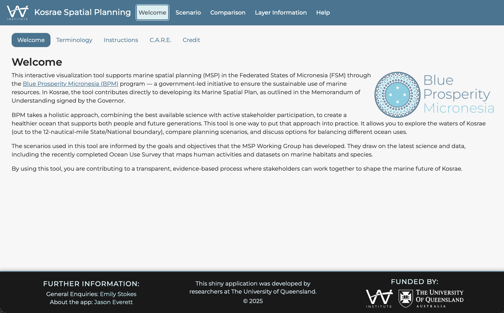{width=70%}

This page is customised for each deployment, so the content will vary depending on your region and project.

## Scenario Tab {#sec-scenario-tab}

The **Scenario** tab is where you run spatial prioritisation analyses. It contains a sidebar with input controls and a main panel displaying results.

### Sidebar Controls

The sidebar contains several sections for configuring your analysis:

#### 1. Setting Targets

Targets specify how much of each feature should be represented in the conservation solution.

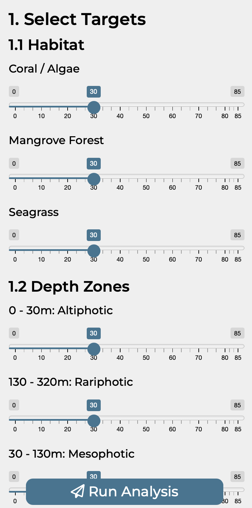{width=50%}

Depending on how the application is configured, targets can be set in three ways:

**Individual Targets**
Each feature has its own slider, allowing fine-grained control. Adjust each slider to set the percentage of that feature you want to protect.

**Category Targets**
Features are grouped into categories (e.g., Habitat, Depth Zones, Spawning Areas). A single slider controls all features within each category.

**Master Target**
A single slider sets the same target for all features at once. This is the simplest option for quick exploration.

::: {.callout-tip}
## Setting Appropriate Targets
For initial exploration, try setting targets around 30% (aligned with 30x30 global conservation commitments). You can then adjust individual features based on their ecological importance or rarity.
:::

#### 2. Selecting a Cost Layer

The cost layer determines which areas are more or less "expensive" to include in the conservation network.

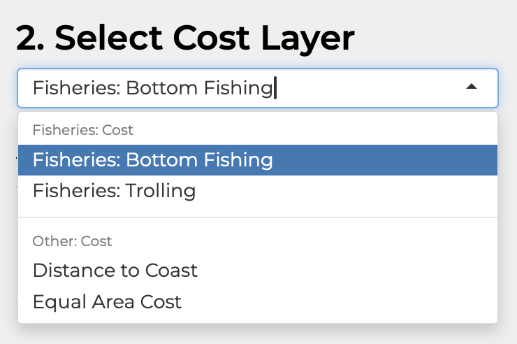{width=70%}

Common cost layer options include:

- **Equal Area Cost**: Every planning unit has the same cost. The algorithm minimises total area selected.
- **Distance to Coast**: Planning units closer to shore generally have a higher cost, reflecting a proxy for higher production and fisheries value.
- **Fisheries Effort**: Areas with higher fishing activity have higher cost, minimising conflict with fisheries.
- **Custom costs**: Region-specific cost layers provided by the data administrator.

#### 3. Choosing a Budget (Minimum Shortfall Objective)

If the application uses the **minimum shortfall objective**, you will see a budget input:

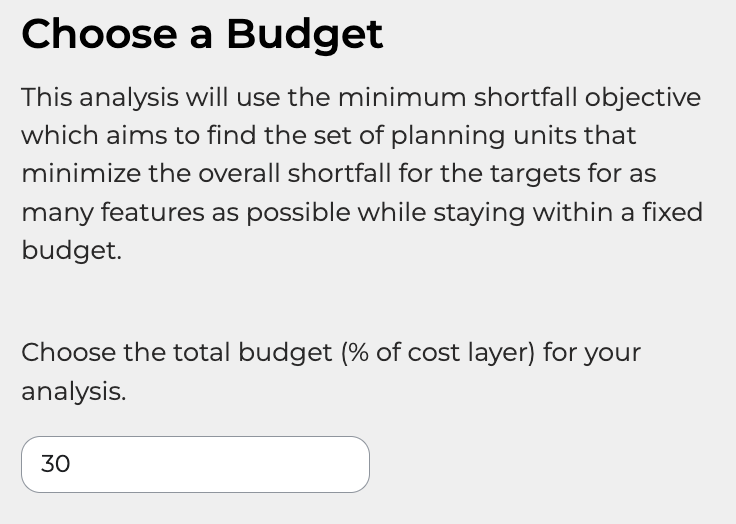{width=70%}

The budget is expressed as a percentage of the total cost layer. For example:

- Budget = 30% means the total cost of selected planning units cannot exceed 30% of the total cost
- Lower budgets force more difficult trade-offs between features
- Higher budgets allow more complete target achievement

::: {.callout-note}
## Minimum Set vs Minimum Shortfall
Some deployments use the **minimum set** objective instead, which finds the cheapest solution that meets *all* targets. In this case, no budget input is shown.
:::

#### 4. Climate-Smart Options

If climate change considerations are enabled, you will see a dropdown to select climate layers:

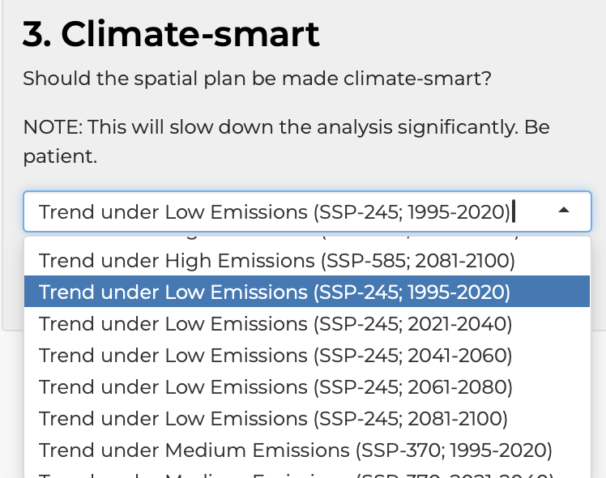{width=70%}

Options typically include:

- **Don't consider**: Run analysis without climate considerations
- **Climate Refugia**: Preferentially select areas projected to experience less climate impact
- **Other climate metrics**: Specific projections or velocity metrics

::: {.callout-warning}
## Performance Note
Enabling climate-smart options increases analysis time. Be patient whilst the analysis runs.
:::

#### 5. Constraints

Constraints allow you to lock certain areas in or out of the solution:

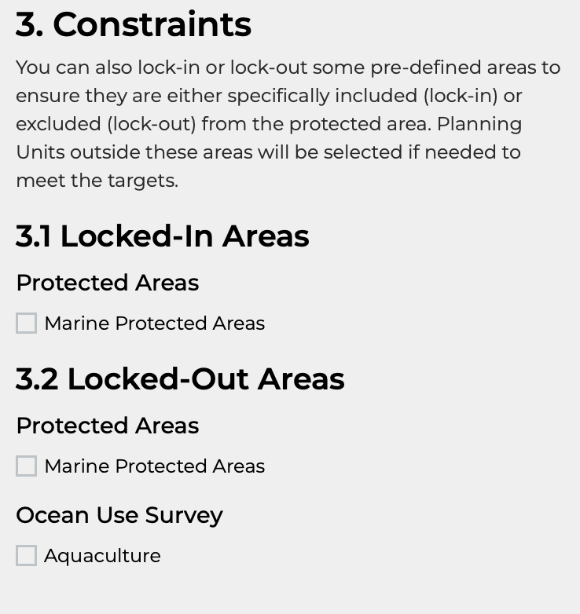{width=70%}

**Locked-In Areas**
Areas that *must* be included in the solution:

- Existing marine protected areas
- Areas with conservation covenants
- Traditional protected areas

**Locked-Out Areas**
Areas that *cannot* be included in the solution:

- Shipping lanes
- Aquaculture zones
- Urban or developed areas
- Areas with incompatible uses

Select the relevant checkboxes to include these constraints in your analysis.

### Running the Analysis

Once you have configured your options, click the **Run Analysis** button at the bottom of the sidebar.

{width=70%}

The analysis typically takes 10-60 seconds depending on:

- The number of planning units
- The number of features
- Whether climate-smart options are enabled

::: {.callout-important}
## Avoid Multiple Clicks
Wait for the analysis to complete before clicking Run Analysis again. Multiple rapid clicks can cause the application to become unresponsive.
:::

### Results Tabs

After running an analysis, results appear in several tabs in the main panel:

#### Scenario Tab

Shows the spatial solution map:

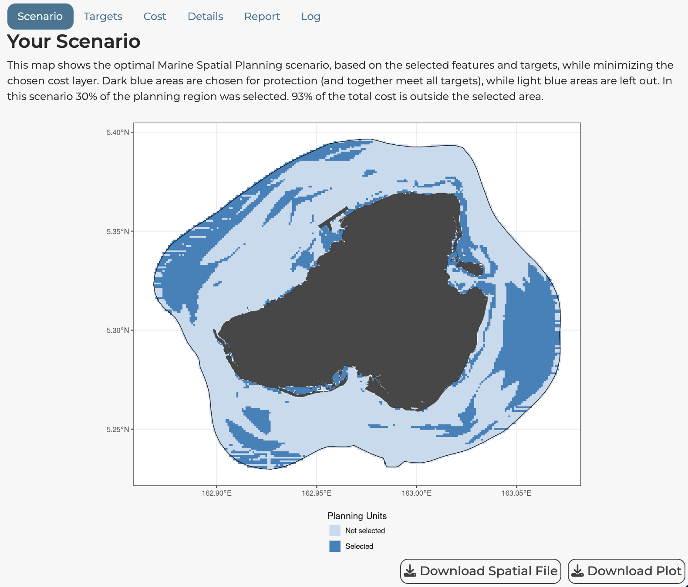{width=70%}

- **Selected planning units**: Shown in colour (typically blue or green)
- **Unselected planning units**: Shown in grey or left empty
- **Locked-in areas**: May be shown in a distinct colour
- **Coastline/boundaries**: Overlaid for context

Use the **Download Plot** button to save the map as an image file.

Use the **Download Spatial File** button to download the solution as a GeoPackage (.gpkg) for use in GIS software.

#### Explore Tab

An interactive Leaflet map allowing you to:

- Zoom and pan around the planning region
- Click on planning units to see details
- Toggle between base map layers
- Examine specific features in selected areas

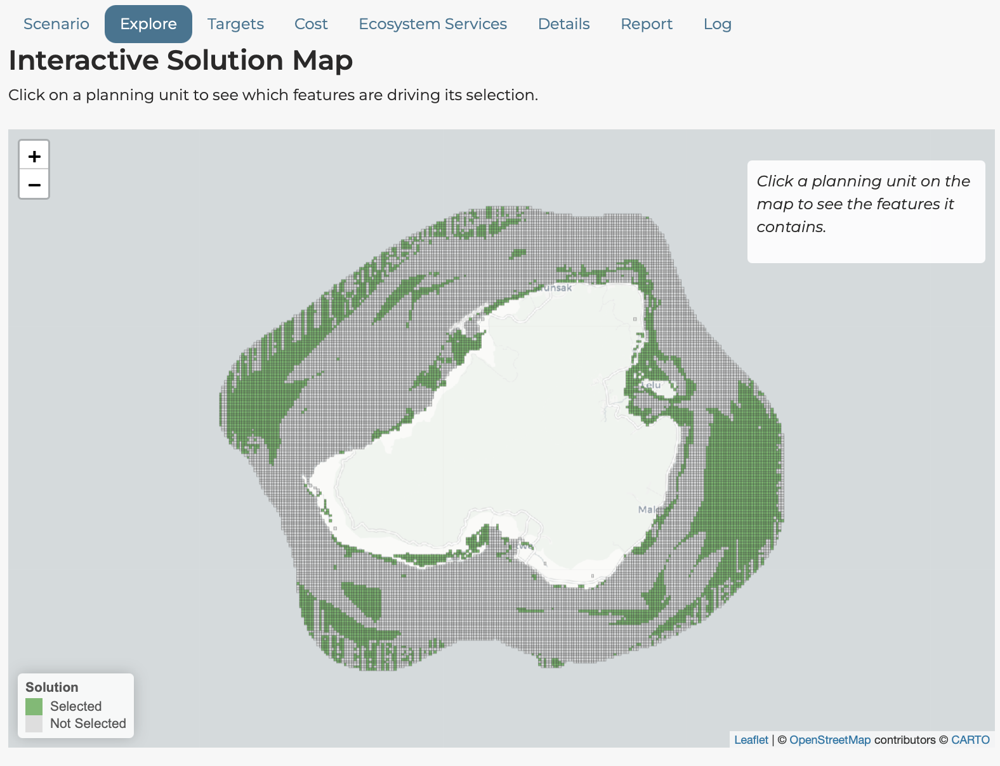{width=70%}

A draggable panel allows you to select which features to display on the map.

#### Targets Tab

Shows a bar chart of target achievement:

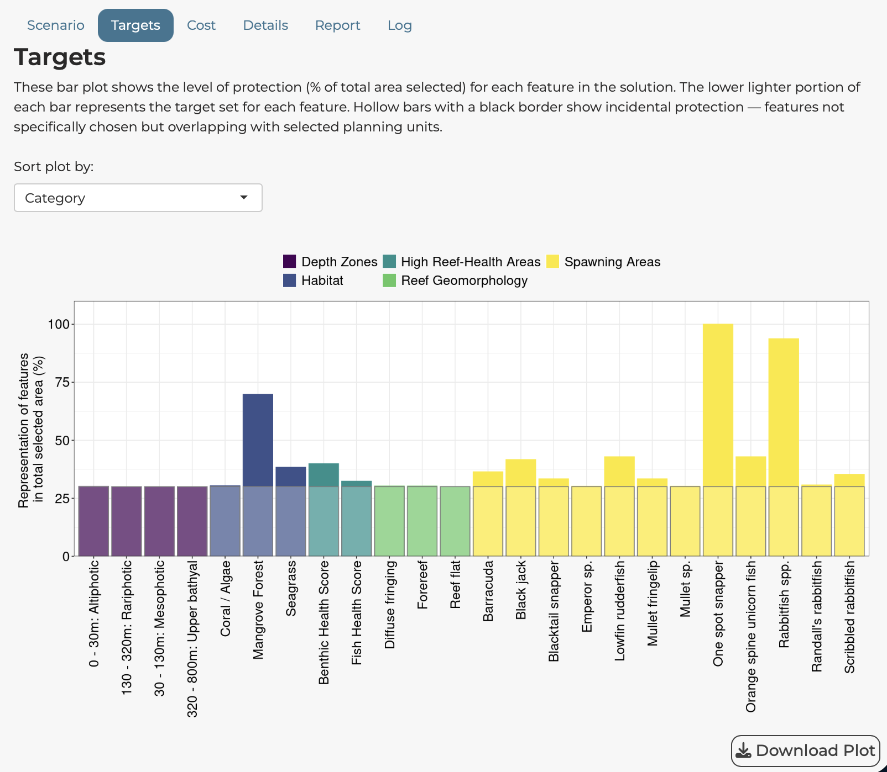{width=70%}

For each feature, the chart shows:

- **Height of the bar**: The percentage actually achieved in the solution
- **Target**: Indicated by a bar with black outline and transparent white fill
- **Colours**: Set by the category of the features

Use the **Sort by** dropdown to order features by:

- Category
- Target value
- Representation achieved
- Difference from target

#### Cost Tab

Shows the spatial distribution of the selected cost layer:

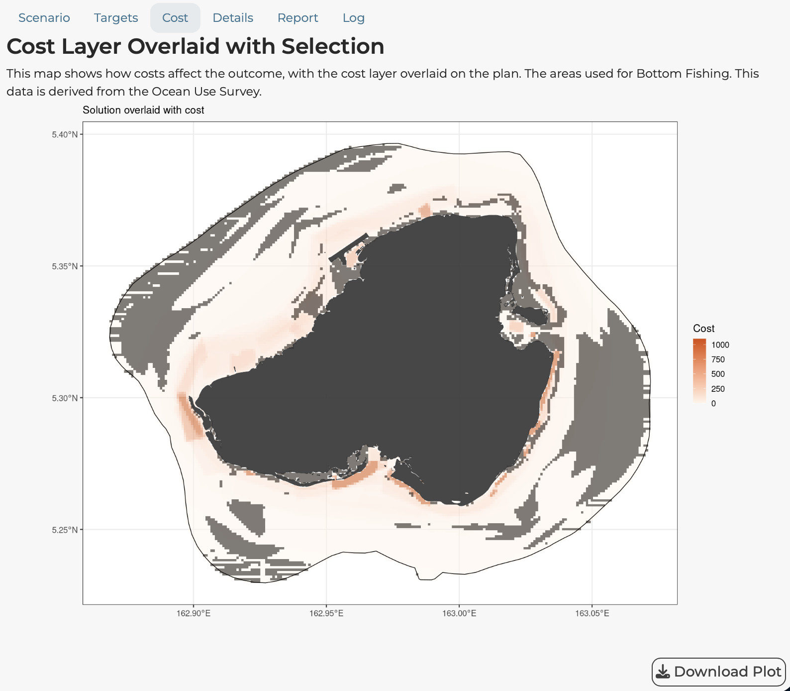{width=70%}

This helps you understand how costs vary across the planning region and where high cost areas are located.

#### Climate Tab

If climate-smart options are enabled, this tab shows:

- The climate layer used in the analysis
- How climate considerations affected planning unit selection

#### Ecosystem Services Tab

If ecosystem services are configured, this tab displays:

- A table of ecosystem service values
- How much of each service is captured by the solution

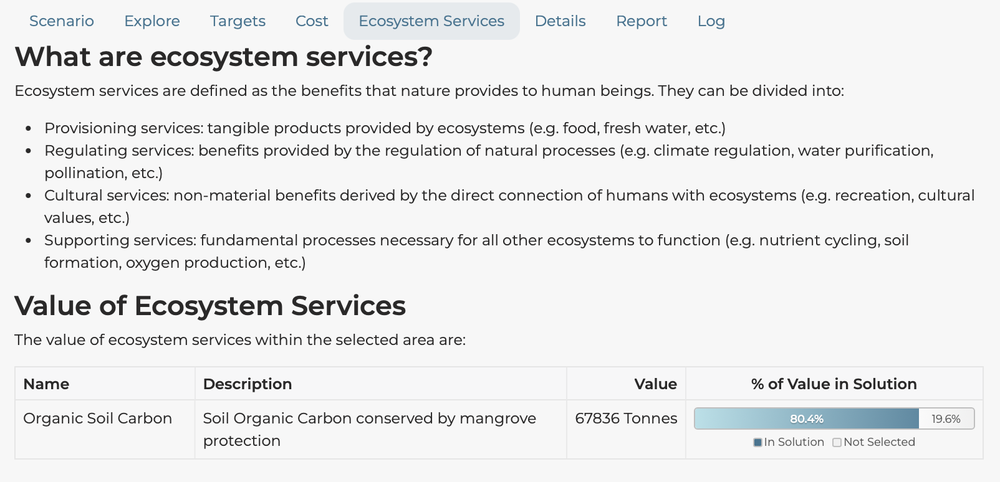{width=70%}

#### Details Tab

A detailed table showing:

- All feature representation values
- Target vs achieved comparisons
- Summary statistics

Use **Download Table** to export this data as a CSV file.

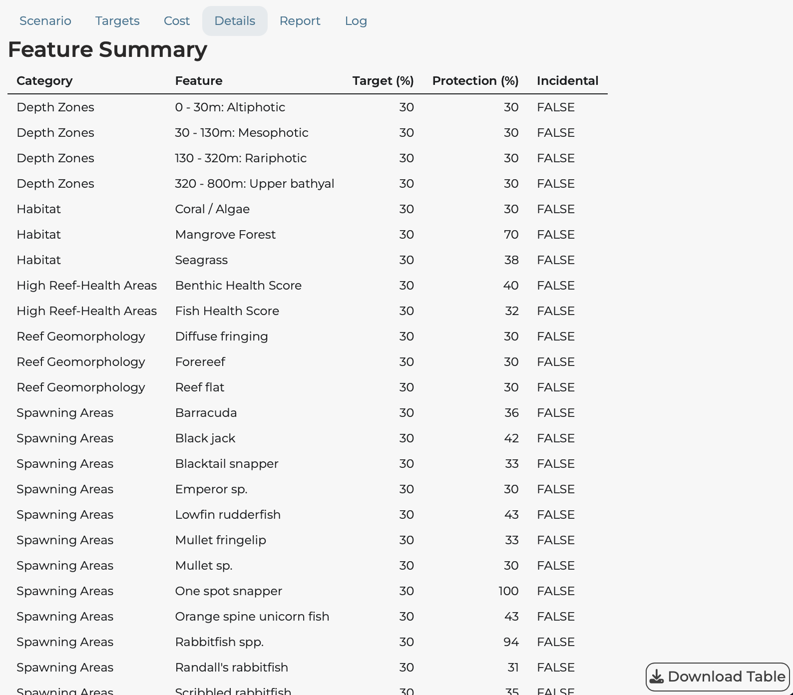{width=70%}

#### Report Tab

Generate a comprehensive HTML report containing all analysis results:

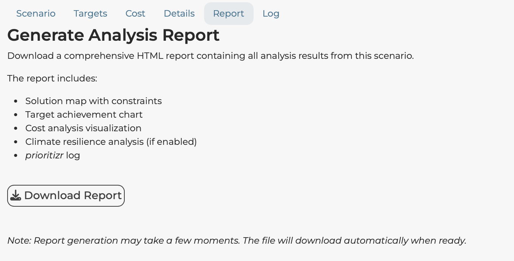{width=70%}

Click **Download Report** to create a self-contained HTML document including:

- Solution map
- Target achievement chart
- Cost analysis
- Climate analysis (if enabled)
- Solver log

This report can be shared with stakeholders who do not have access to the application.

#### Log Tab

Shows the technical output from the *prioritizr* solver:

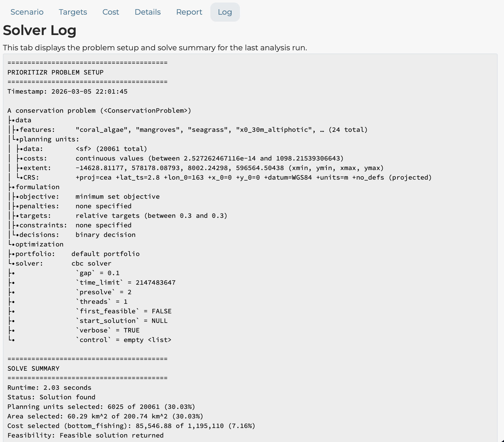{width=70%}

This is useful for understanding solver performance and troubleshooting.

## Comparison Tab {#sec-comparison-tab}

The **Comparison** tab allows you to run two scenarios side-by-side and compare outcomes.

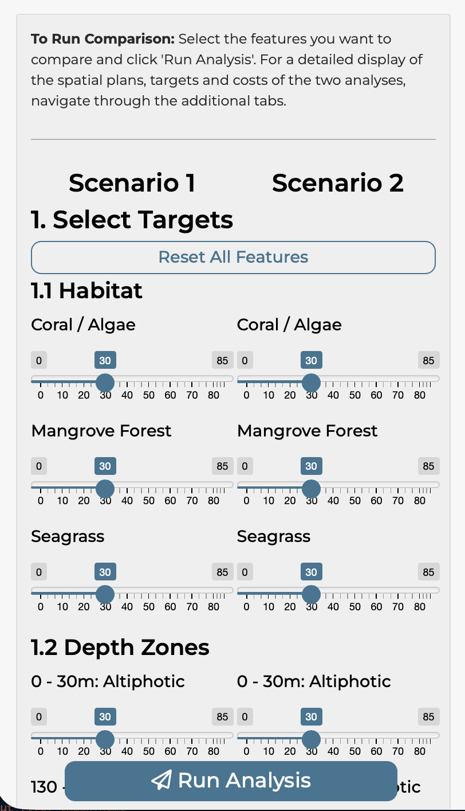{width=70%}

### Setting Up a Comparison

The interface mirrors the Scenario tab but with duplicate controls:

- **Scenario 1** and **Scenario 2** columns
- Independent target sliders for each scenario
- Independent cost layer selection
- Independent budget settings (if applicable)
- Independent constraint selection

Common comparison scenarios include:

- Different target levels (20% vs 40%)
- Different cost layers (equal area vs fisheries effort)
- With vs without climate-smart options
- Different locked-in area configurations

### Running the Comparison

Click **Run Analysis** to execute both scenarios simultaneously.

### Interpreting Comparison Results

The comparison tab shows a direct overlay of the two solutions. 

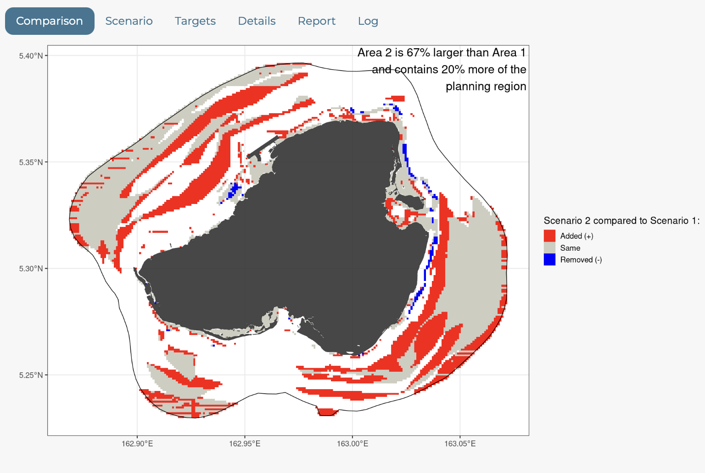{width=70%}

Comparison tabs show side-by-side comparisons:

- **Maps**: Both solutions displayed together
- **Targets**: Bar charts for both scenarios
- **Statistics**: Summary comparison table

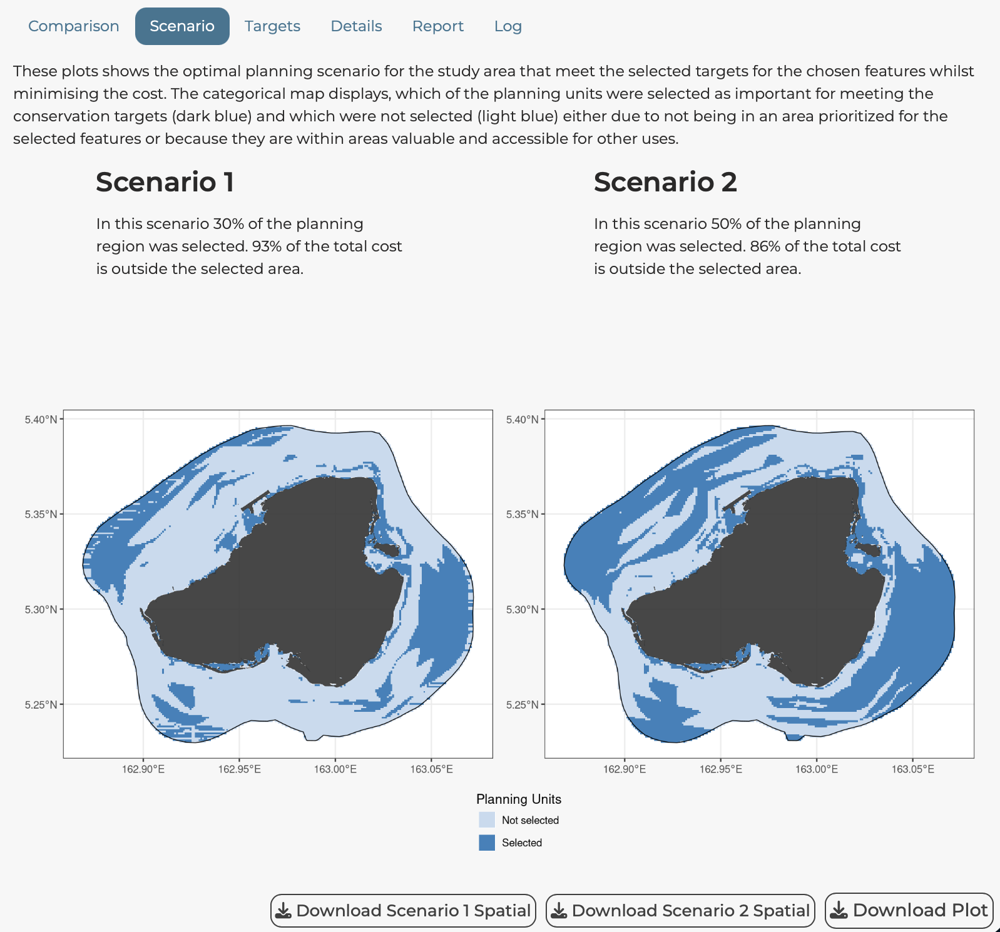{width=70%}

This allows direct visual and quantitative comparison of how different choices affect outcomes.

## Layer Information Tab {#sec-layer-info}

The **Layer Information** tab allows you to examine the spatial data underlying the analysis.

### Feature Density

Shows overall feature density across planning units:

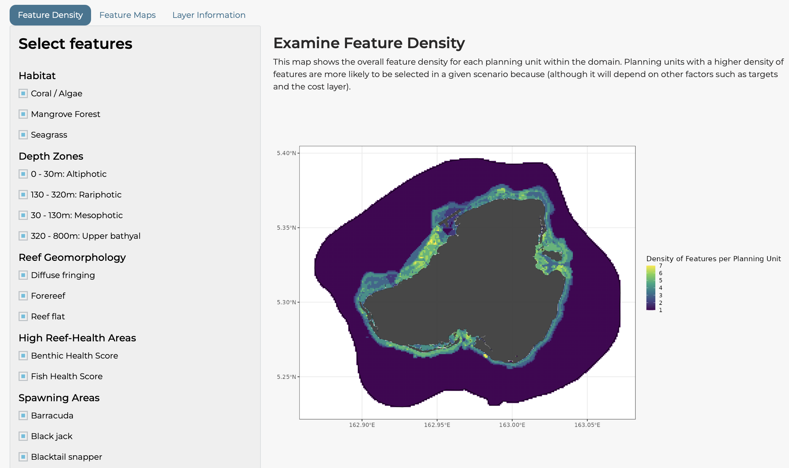{width=70%}

Planning units with higher feature density are more likely to be selected because they contribute to multiple targets simultaneously.

Select which features to include in the density calculation using the checkboxes.

### Feature Maps

Visualise individual features:

1. Select a feature from the dropdown
2. View its spatial distribution
3. Read the justification text explaining the data source

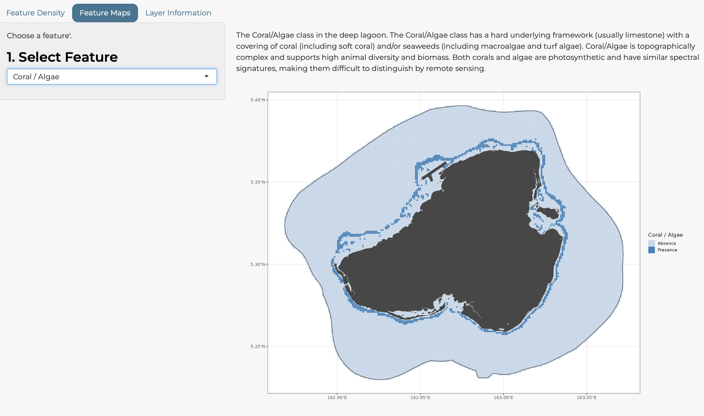{width=70%}

### Layer Information Table

A comprehensive table listing all data layers with:

- Common name
- Variable name
- Category
- Type (Feature, Cost, Constraint)
- Data source and justification

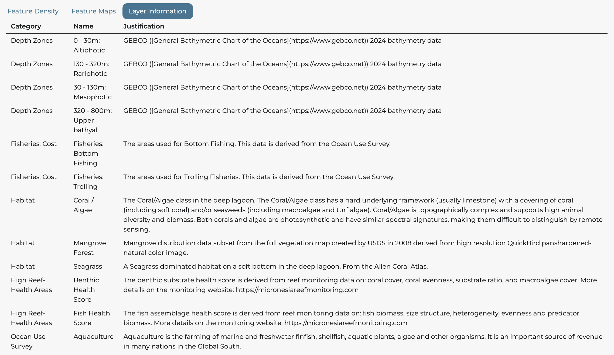{width=70%}

## Check Coverage Tab {#sec-check-coverage}

The **Check Coverage** tab allows you to upload your own spatial file and evaluate how well it conserves the features in the planning domain.

### Uploading a File

1. Click **Choose a spatial file**
2. Select a GeoPackage (.gpkg), File Geodatabase (.gdb), or GeoJSON (.geojson) file
3. Wait for the file to upload and process

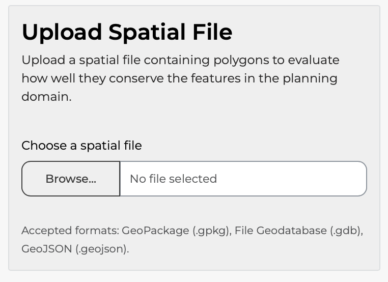{width=70%}

### Viewing Results

After upload, you will see:

- **Map**: Your uploaded polygons displayed on an interactive map
- **Coverage Chart**: Bar chart showing how much of each feature falls within your polygons

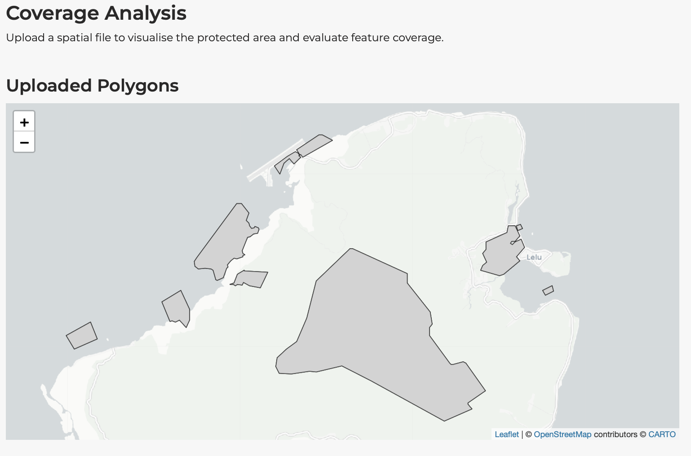{width=70%}

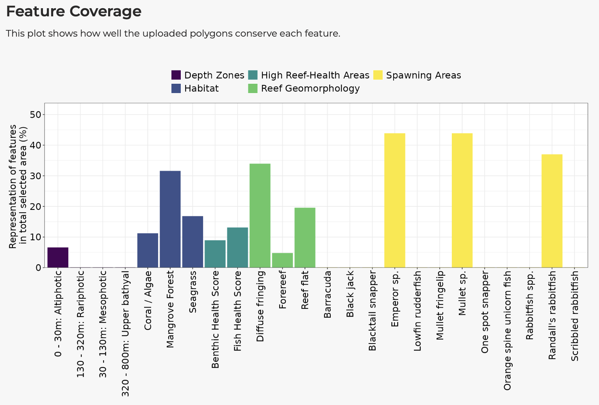{width=70%}

This is useful for:

- Evaluating existing protected area networks
- Testing proposed zoning schemes
- Comparing stakeholder-proposed areas to optimal solutions

## Help Tab {#sec-help-tab}

The **Help** tab provides additional information:

### Frequently Asked Questions

Common questions about using the application:

- "Does the app run in real time?"
- "Why is the download button not working?"
- "Can I compare more than two spatial plans?"

### Technical Information

Details about:

- The prioritisation algorithm
- Data sources and processing
- Solver specifications
- Version information

## Tips for Effective Use

### Start Simple

1. Begin with default settings to understand the baseline
2. Change one parameter at a time to understand its effect
3. Gradually build up to more complex scenarios

### Document Your Analyses

- Use the **Download Report** feature to save complete records
- Take screenshots of key results
- Note which settings produced each result

### Engage Stakeholders

- Use the comparison feature to show trade-offs
- Download maps and charts for presentations
- Allow stakeholders to explore scenarios themselves

### Understand Limitations

- Results are only as good as the input data
- Optimal solutions are mathematically optimal, not necessarily politically optimal
- Ground-truthing and expert review remain essential

## Troubleshooting

### The Application is Slow

- Reduce the number of features if possible
- Disable climate-smart options for initial exploration
- Check your internet connection

### Analysis Fails

- Ensure targets are realistic (not 100% for all features)
- Check that constraint options are compatible
- Try reducing the budget slightly

### Results Look Unexpected

- Review the solver log for warnings
- Check which constraints were active
- Verify target and cost layer selections

### Session Timed Out

- The application will display a "Session timed out" message
- Click **Reload now** to restart
- Your previous settings will need to be re-entered

## Summary

The *shinyplanr* application provides an accessible interface for spatial conservation prioritisation. Key operations include:

1. **Setting targets** for biodiversity features
2. **Selecting cost layers** to reflect real-world constraints
3. **Configuring constraints** for locked-in and locked-out areas
4. **Running analyses** and interpreting results
5. **Comparing scenarios** to explore trade-offs
6. **Downloading results** for reports and further analysis

The [Setting Up vignette](ac-setting-up.html) explains how to set up *shinyplanr* for a new region.
